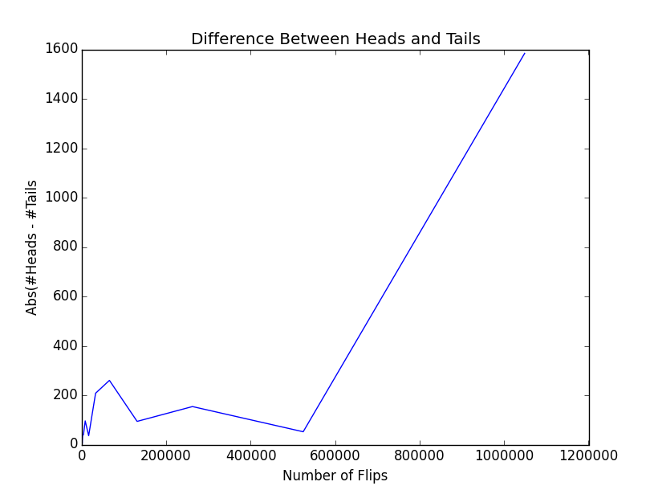
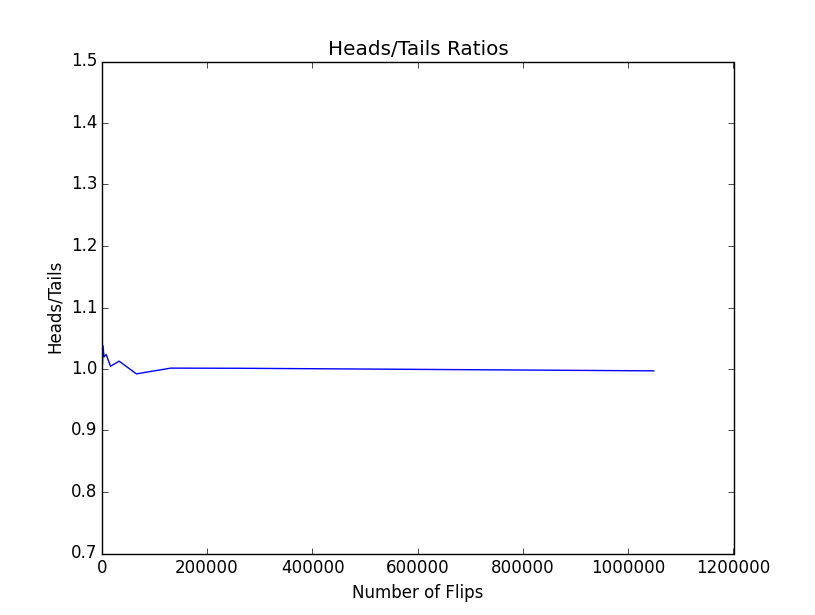
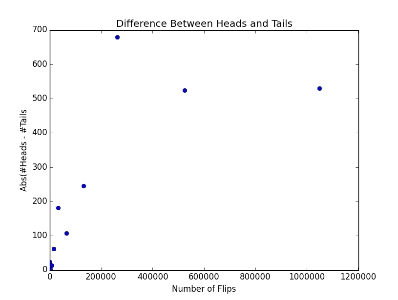
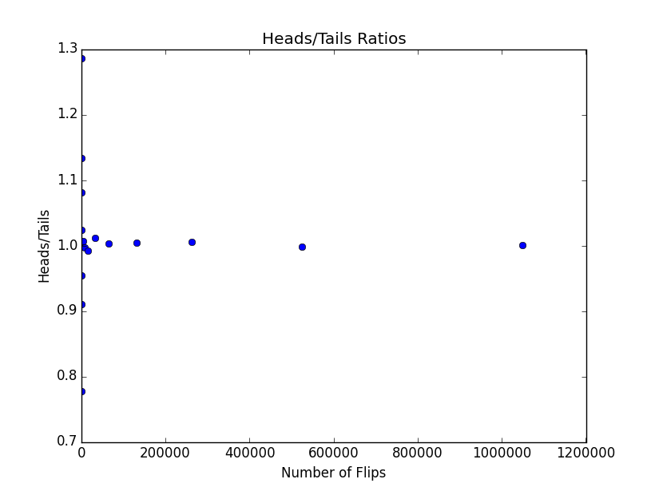
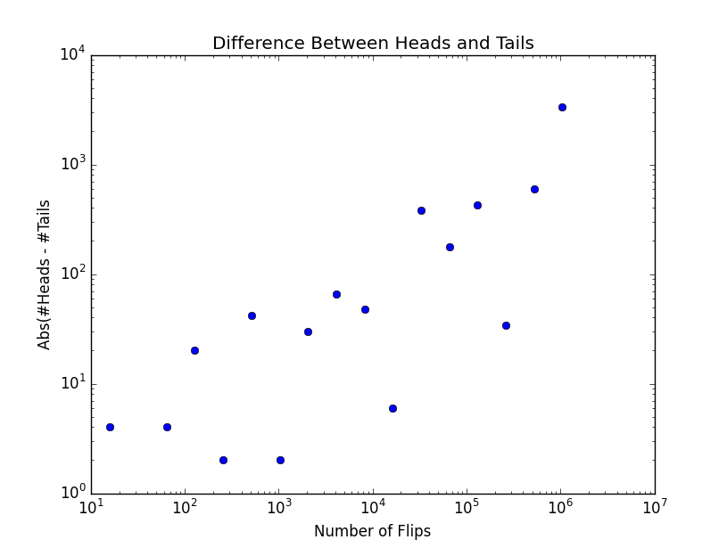
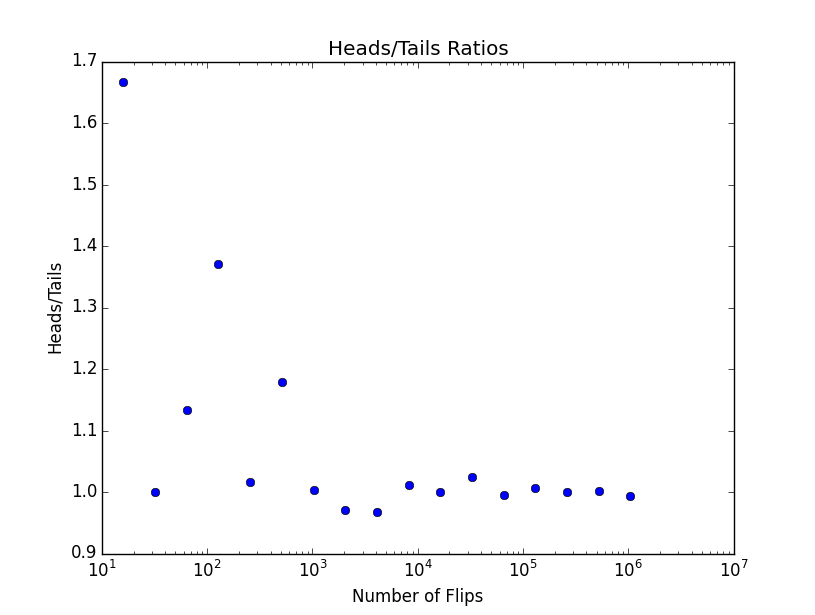

# MIT 6.00SC | Lecture 14 | Sampling and Monte Carlo Simulation #

## [Data Visualization](https://www.youtube.com/watch?v=ddtobc-AOK4&list=PLB2BE3D6CA77BB8F7#t=43) ##

Consider the below example code:-

````
import pylab

principal = 10000 #initial investment
interestRate = 0.05
years = 20
values = []
for i in range(years + 1):
    values.append(principal)
    principal += principal*interestRate
pylab.plot(values)
pylab.show()
````

The above code will show you the power of compounding in investment, but the graph plotted with the above code is useless because you cannot find out what does this graph shows i.e. it does not have a heading, also it does not represent what is `X` and `Y` axis.

Fortunately it is easy enough to do it:-

````
import pylab

principal = 10000 #initial investment
interestRate = 0.05
years = 20
values = []
for i in range(years + 1):
    values.append(principal)
    principal += principal*interestRate
pylab.plot(values)

pylab.title('5% Growth, Compounded Annually')
pylab.xlabel('Years of Compounding')
pylab.ylabel('Value of Principal ($)')

pylab.show()
````

With this 3 methods of `pylab`, it is easy enough to do it, `pylab.title()`, `pylab.xlabel` and `pylab.ylabel()`.

## [Randomness and Probability ](https://www.youtube.com/watch?v=ddtobc-AOK4&list=PLB2BE3D6CA77BB8F7#t=284) ##

It is better to understand probability with a example, *What is the probability of not getting a single one in a roll of dice, when rolled for 10 times?*

The wrong way of solving this is by doing this:-

The probability of not getting 1 in a 1 roll of dice is `5/6`.
The probability of not getting 1 in a 2 roll of dice is `5/6`.

Now the wrong way would be to add `5/6` 10 times, but this is wrong because the final probability will be `8.3`, and we all know that probability lies between `1` and `0`. It can never be greater than `1`.

The right way to solve this problem will be.

How many different 10 digit numbers can be made when we roll a 6 sided dice for 10 times, it is `6 ^ 10`. Same as the number of binary digit number can be formed with 10 bytes which is `2^10`.

So as we checked in the wrong way, 
what is the probability of not getting 1 in a first roll of dice = `5/6`.

what is the probability of not getting 1 in a second roll of dice = `5/6`

The second roll of dice is not dependent on the outcome of the first roll of dice, this is what we call **Independent Events.**

So after 10 times what will be the probability = 

````
5/6 * 5/6 * 5/6 * 5/6 * 5/6 * 5/6 * 5/6 * 5/6 * 5/6 * 5/6  = (5/6) ^ 10 = 0.16150558288984572135006520008806
````

So the above explanation answers our initial question *What is the probability of not getting a single one in a roll of dice, when rolled for 10 times?*

Now lets modify the question a little bit, *What is the probability of atleast  getting a single one in a roll of dice, when rolled for 10 times?*
which will be `1 - (5/6) ^ 10`. Because we know that the sum of all different probability will be 1, and we have found out the probability of not getting any 1, so the probability of getting at least one 1 will be `1 - (5/6) ^ 10`.

This is a very common trick in computing probability, so when someone ask what is the probability of x, we can simply calculate the probability of not x and then subtract it from 1.

So lets solve another interesting problem.

*Given a pair of fair dice, if rolled 24 times, what is the probability of rolling a double 6?*

So lets solve this problem:-

What is the probability of getting 6 in a single roll on a single dice = `1/6`

What is the probability of getting 6 in a single roll on a second dice = `1/6`

So the probability of getting 6 in a single roll of both dice is `1/36`, and the probability of not getting 6 in a single roll of both dice is `1 - 1/36 = 35/36`.

So what is the probability of not getting 6, 24 times in a row = `(35/36) ^ 24 = 0.50859612386909674041792802317515`

So now lets solve this using code, what we call simulation, and see if the calculation is correct.:-

````
import random

def rollDie():
    """returns a random int between 1 and 6"""
    return random.choice([1,2,3,4,5,6])

def checkPascal(numTrials = 100000):
    yes = 0.0
    for i in range(numTrials):
        for j in range(24):
            d1 = rollDie()
            d2 = rollDie()
            if d1 == 6 and d2 == 6:
                yes += 1
                break
    print 'Probability of losing = ' + str(1.0 - yes/numTrials)

checkPascal()   
````


## [Monte Carlo Simulation](https://www.youtube.com/watch?v=ddtobc-AOK4&list=PLB2BE3D6CA77BB8F7#t=1364) ##

The Above code is what we call a Monte Carlo Simulation. Monte Carlo Simulation are example of what we call inferential statistics.

### [Inferential Statistics](https://www.youtube.com/watch?v=ddtobc-AOK4&list=PLB2BE3D6CA77BB8F7#t=1574) ###

Inferential Statistics in brief it is based on one guiding principle, A random sample tends to exhibit the same properties as the population from which it is drawn.

The problem is, the above assumptions are sometimes wrong, which we will see later.

Consider an example, *What if we flipped a coin 100 times, and we get 52 heads and 48 tails, what do this infer?*

Do we infer that if we again flipped a coin 100 times we will get the same heads and tails ratio, probably not, even we will not be comfortable in saying that there will be more heads than tails based on the above sample.

A proper way to infer something will be, What is the total number of tests done and how closely the answer is when we did things in random. This is something called a [Null hypothesis ](http://en.wikipedia.org/wiki/Null_hypothesis)

Consider the below example:-

````
def flipCoin(numFlips):
    heads = 0
    for i in range(numFlips):
        if random.random() < 0.5:
            heads += 1
    return heads/float(numFlips)
````

The above code is a simple coin flip code, which will flip a coin for `numFlips` times, and will tell us how may times we get heads, we already know that we should get a answer near `0.5`. So here is the output when run different number of times:-

````
Flip 100 times
CoinFlip i =  0  flipCoin(100):  0.49
CoinFlip i =  1  flipCoin(100):  0.44
CoinFlip i =  2  flipCoin(100):  0.5
CoinFlip i =  3  flipCoin(100):  0.46
CoinFlip i =  4  flipCoin(100):  0.53
CoinFlip i =  5  flipCoin(100):  0.45
CoinFlip i =  6  flipCoin(100):  0.56
CoinFlip i =  7  flipCoin(100):  0.51
CoinFlip i =  8  flipCoin(100):  0.44
CoinFlip i =  9  flipCoin(100):  0.56
Flip 1000000 times
CoinFlip i =  0  flipCoin(1000000):  0.499925
CoinFlip i =  1  flipCoin(1000000):  0.499876
CoinFlip i =  2  flipCoin(1000000):  0.500231
CoinFlip i =  3  flipCoin(1000000):  0.499441
CoinFlip i =  4  flipCoin(1000000):  0.499637
CoinFlip i =  5  flipCoin(1000000):  0.49971
CoinFlip i =  6  flipCoin(1000000):  0.49968
CoinFlip i =  7  flipCoin(1000000):  0.50031
CoinFlip i =  8  flipCoin(1000000):  0.499946
````

So as we can see, when the `numFlips` is more like `1000000`, we get answers close to `0.5`.

The above is an example of **Law of large numbers,** or [Bernoulli's Law of Large Numbers](http://en.wikipedia.org/wiki/Law_of_large_numbers).

### [Law of Large Numbers](https://www.youtube.com/watch?v=ddtobc-AOK4&list=PLB2BE3D6CA77BB8F7#t=2027) ###

The law states, In repeated **independent** tests with the same actual probability `P` chance that fraction of times outcome occurs converges to `P` as no of test goes to infinity.

This law does not states that if we start out with deviation in the expected behavior, those deviation will eventually be even out. That means, if in a coin flip we initially get a sequence of Heads, does not means we will have more tails towards the end, because as mentioned above it depends on tests to be **independents**. This is what we call [Gambler's fallacy ](http://en.wikipedia.org/wiki/Gambler%27s_fallacy)

This laws also does not states that, with increase in number of trails, the absolute difference between the number of heads and tails will get smaller.

Now consider an example for the same:-

````
import random 
import pylab

def flipPlot(minExp,maxExp):
    ratios = []
    diffs = []
    xAxis = []
    for exp in range(minExp,maxExp+1):
        xAxis.append(2 ** exp)
    print "xAxis: ", xAxis            
    for numFlips in xAxis:
        numHeads = 0
        for n in range(numFlips):
            if random.random() < 0.5:
                numHeads += 1
        numTails = numFlips - numHeads
        ratios.append(numHeads/float(numTails))
        diffs.append(abs(numHeads - numTails))
    pylab.title('Difference Between Heads and Tails')
    pylab.xlabel('Number of Flips')
    pylab.ylabel('Abs(#Heads - #Tails')
    pylab.plot(xAxis, diffs)
    pylab.figure()
    pylab.plot(xAxis, ratios)
    pylab.title('Heads/Tails Ratios')
    pylab.xlabel('Number of Flips')
    pylab.ylabel('Heads/Tails')


flipPlot(4,20)  
pylab.show()

````

Here is the output of the same:-

* 
* 

From the graph of Difference between heads and tails, it will look like we have trend in which the difference shoots up dramatically. But is this really a happening?

The reason this is happening because, the default behavior of pylab is to connect the dots with lines. So this can be a problem because as a user you may think you have a trend but it really may be an outliers, because the number of points can be as low as 2 or 3.

So if we modify the code to plot points:-

````
import random 
import pylab

def flipPlot(minExp,maxExp):
    ratios = []
    diffs = []
    xAxis = []
    for exp in range(minExp,maxExp+1):
        xAxis.append(2 ** exp)
    print "xAxis: ", xAxis
    for numFlips in xAxis:
        numHeads = 0
        for n in range(numFlips):
            if random.random() < 0.5:
                numHeads += 1
        numTails = numFlips - numHeads
        ratios.append(numHeads/float(numTails))
        diffs.append(abs(numHeads - numTails))
    pylab.figure()
    pylab.title('Difference Between Heads and Tails')
    pylab.xlabel('Number of Flips')
    pylab.ylabel('Abs(#Heads - #Tails')
    pylab.plot(xAxis, diffs, 'bo') #do not connect, show dot
    pylab.figure()
    pylab.plot(xAxis, ratios, 'bo') #do not connect, show dot
    pylab.title('Heads/Tails Ratios')
    pylab.xlabel('Number of Flips')
    pylab.ylabel('Heads/Tails')
    # pylab.semilogx()

flipPlot(4,20)  
pylab.show()
````

The output will be:-
* 
* 

So if we see the "Difference between heads and tails" figure, we will see the dots are petty sparse, which will make it difficult to show a trends.

Since the scale of the x and y axis is petty vast just change it to log axis and see the difference.

* 
* 

## Reference ##
### Links ###

1. [MIT OCW](http://ocw.mit.edu/courses/electrical-engineering-and-computer-science/6-00sc-introduction-to-computer-science-and-programming-spring-2011/unit-2/lecture-14-sampling-and-monte-carlo-simulation/)
2. [Lecture Code handout (PDF)](http://ocw.mit.edu/courses/electrical-engineering-and-computer-science/6-00sc-introduction-to-computer-science-and-programming-spring-2011/unit-2/lecture-14-sampling-and-monte-carlo-simulation/MIT6_00SCS11_lec14.pdf)
3. [Lecture code (Py)](http://ocw.mit.edu/courses/electrical-engineering-and-computer-science/6-00sc-introduction-to-computer-science-and-programming-spring-2011/unit-2/lecture-14-sampling-and-monte-carlo-simulation/lec14.py)

### Problem Sets ###

1. Problem Set 6: Simulating Robots (Due)
    1. [Instructions (PDF)](http://ocw.mit.edu/courses/electrical-engineering-and-computer-science/6-00sc-introduction-to-computer-science-and-programming-spring-2011/unit-2/lecture-14-sampling-and-monte-carlo-simulation/MIT6_00SCS11_ps6.pdf)
    2.  [Code files (ZIP) ](http://ocw.mit.edu/courses/electrical-engineering-and-computer-science/6-00sc-introduction-to-computer-science-and-programming-spring-2011/unit-2/lecture-14-sampling-and-monte-carlo-simulation/ps6.zip)
    3. [Solutions (ZIP)](http://ocw.mit.edu/courses/electrical-engineering-and-computer-science/6-00sc-introduction-to-computer-science-and-programming-spring-2011/unit-2/lecture-14-sampling-and-monte-carlo-simulation/ps6_sol.zip)
2. Problem Set 7 (Assigned)
    1. [Problem Set 7 Due on Lecture 16](http://ocw.mit.edu/courses/electrical-engineering-and-computer-science/6-00sc-introduction-to-computer-science-and-programming-spring-2011/unit-2/lecture-16-using-randomness-to-solve-non-random-problems)


### Further Study ###

1. **Readings**
    1. [Monte Carlo method ](http://en.wikipedia.org/wiki/Monte_Carlo_method)


### Check Yourself ###
### Can probabilities be added? ###
### What is a Monte Carlo simulation? ###
### What is the guiding principle of inferential statistics? ###
### What is the law of large numbers (a.k.a. Bernoulli's Law)? ###
### What is the gambler's fallacy? ###


