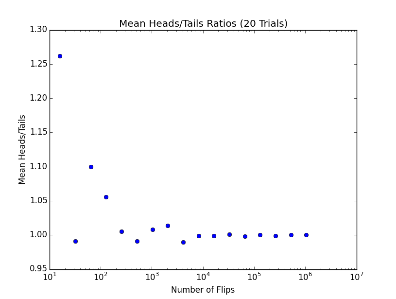
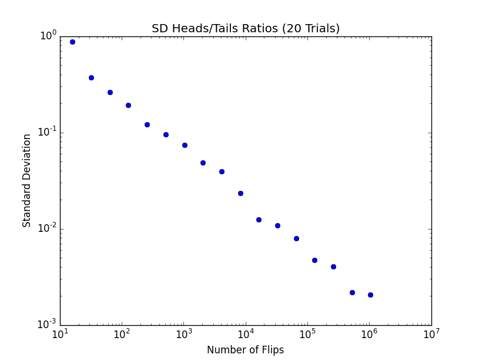
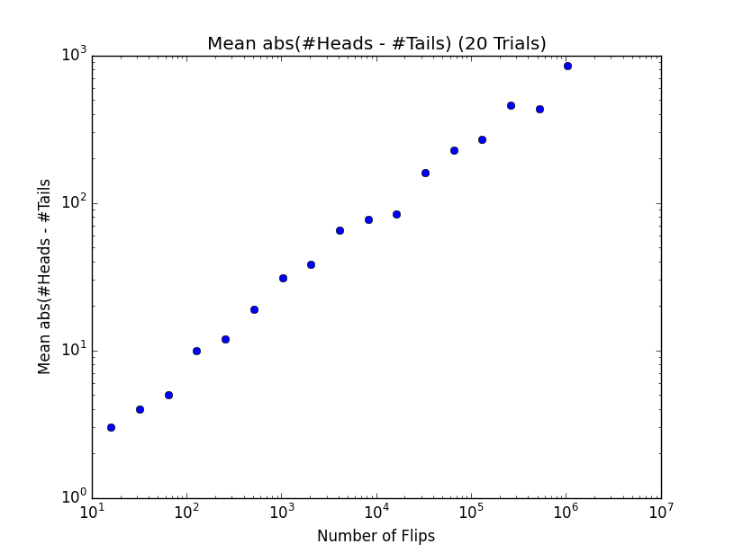
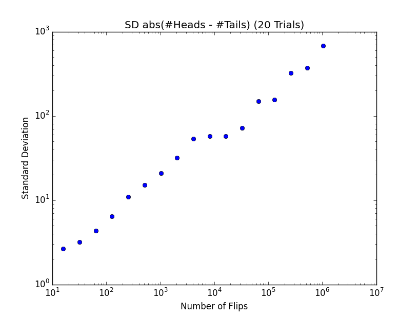
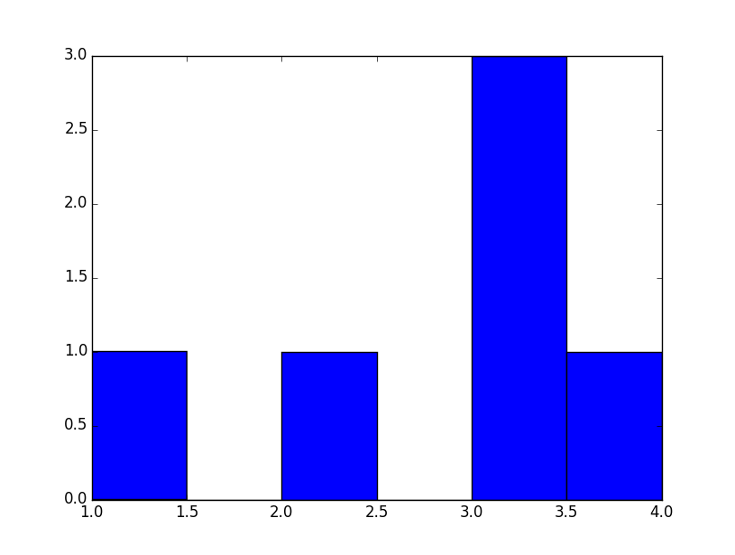
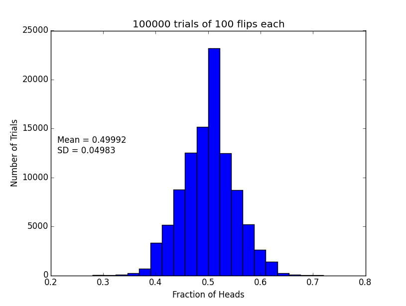
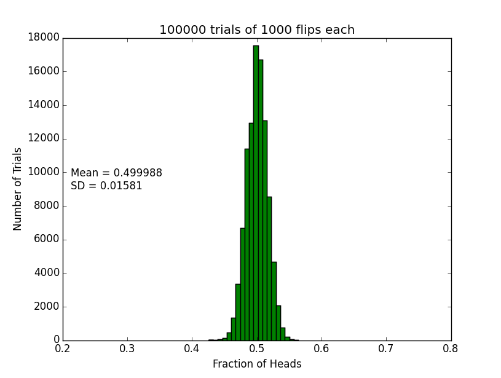
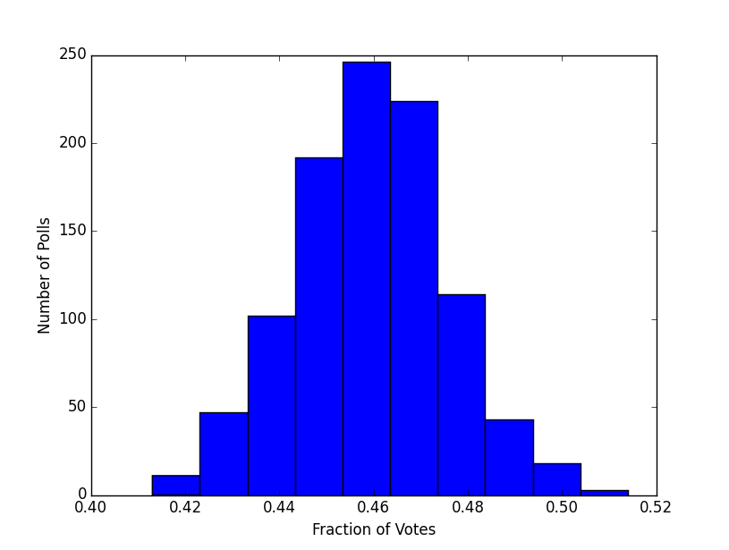

# MIT 6.00SC | Lecture 15 | Statistical Thinking #

## [Introduction ](https://www.youtube.com/watch?v=VqZBqoZgL7k&list=PLB2BE3D6CA77BB8F7#t=85) ##

At the end of lecture 14, we were flipping coin, and trying to find number of sample which is enough to safely say that the probability of getting a head or tails after n trails is 0.5.

So to solve this, we can flip a coin just 2 times and get head and tails, now with this we will have the probability of 0.5 which is the correct answer, but the sample size is not good enough, because if we flipped it twice and got heads both the times, we cannot assume the probability is 1 for getting heads.

So the important question which we will answer in this lecture is **How many samples do we need to believe the answer?**

Fortunately there is a very solid set of mathematics which will help us get to this answer.

## [Variance ](https://www.youtube.com/watch?v=VqZBqoZgL7k&list=PLB2BE3D6CA77BB8F7#t=205) ##

Variance is at the root of the answer to the above question. So **variance** is a measure of how much spread there is in the possible outcomes.

So to use variance, we should have different outcomes, which is we want to run multiple trials, which is why we need to run multiple trials rather than 1 trails with multiple flips in case of coin.

The question which we should think of is, why we should do a million trails of coin flips rather than 1 trails with a million flips? The reason for doing a million trails is for each trails we will get a outcome which gives us a fair idea of the spread of outcome i.e. variance.


We can formalize the concept of Variance, which is called **Standard Deviation**.

## [Standard Deviation ](https://www.youtube.com/watch?v=VqZBqoZgL7k&list=PLB2BE3D6CA77BB8F7#t=329) ##

The fraction of values which are close to the mean.

As quoted in [wikipedia ](http://en.wikipedia.org/wiki/Standard_deviation).

>  A low standard deviation indicates that the data points tend to be very close to the mean (also called the expected value) of the set, while a high standard deviation indicates that the data points are spread out over a wider range of values.

If all values are the same, the standard deviation is `0`.

Here is the mathematical formula for standard deviation:-


and the code to calculate standard deviation will be:- 

````
def stdDev(X):
    mean = sum(X)/float(len(X))
    total = 0.0
    for x in X:
        total += (x - mean)**2
    return (total/len(X)) ** 0.5
````

So see the steps to find standard deviation kindly see this link, [Standard Deviation Formulas](http://www.mathsisfun.com/data/standard-deviation-formulas.html)

We have now understood what a standard deviation is, now what is the use of it?

Standard deviation will be used to look at the relationship between the number of samples we have looked at and how much confidence we should have in the answer.

Lets understand standard deviation with the help of this code:-

````
import random, pylab
import example01
def flipPlot(minExp, maxExp,numTrials):
    meanRatios = []
    meanDiffs = []
    ratiosSDs = []
    diffsSDs = []
    xAxis = []
    for exp in range(minExp,maxExp + 1):
        xAxis.append(2**exp)
    for numFlips in xAxis:
        ratios = []
        diffs = []
        for t in range(numTrials):
            numHeads = 0
            for n in range(numFlips):
                if random.random() < 0.5:
                    numHeads += 1
            numTails = numFlips - numHeads
            ratios.append(numHeads/float(numTails))
            diffs.append(abs(numHeads - numTails))
        meanRatios.append(sum(ratios)/numTrials)
        meanDiffs.append(sum(diffs)/numTrials)
        ratiosSDs.append(example01.stdDev(ratios))
        diffsSDs.append(example01.stdDev(diffs))
    pylab.plot(xAxis, meanRatios, 'bo')
    pylab.title('Mean Heads/Tails Ratios ('
                + str(numTrials) + ' Trials)')
    pylab.xlabel('Number of Flips')
    pylab.ylabel('Mean Heads/Tails')
    pylab.semilogx()
    pylab.figure()
    pylab.plot(xAxis, ratiosSDs, 'bo')
    pylab.title('SD Heads/Tails Ratios ('
                + str(numTrials) + ' Trials)')
    pylab.xlabel('Number of Flips')
    pylab.ylabel('Standard Deviation')
    pylab.semilogx()
    pylab.semilogy()
    pylab.figure()
    pylab.title('Mean abs(#Heads - #Tails) ('
                + str(numTrials) + ' Trials)')
    pylab.xlabel('Number of Flips')
    pylab.ylabel('Mean abs(#Heads - #Tails')
    pylab.plot(xAxis, meanDiffs, 'bo')
    pylab.semilogx()
    pylab.semilogy()
    pylab.figure()
    pylab.plot(xAxis, diffsSDs, 'bo')
    pylab.title('SD abs(#Heads - #Tails) ('
                + str(numTrials) + ' Trials)')
    pylab.xlabel('Number of Flips')
    pylab.ylabel('Standard Deviation')
    pylab.semilogx()
    pylab.semilogy()

flipPlot(4, 20, 20)
pylab.show()    
````

Now let us analyze the plots:-

* Mean of Head to Tails ratio.
     

    * In the above plot you can see that when the number of flips are small, the points varies significantly and once the number of flips increases it sort of stabilize around 1.
+ Standard Deviation of Heads 2 Tails Ratio
     
     * As we flip more coin, the variance of trails becomes smaller, because in some sense randomness is playing less important role. Which means the more random trails we do, we will get answers near to the actual representation of the truth, and that is the reason standard deviation will drop.
+ Absolute Difference between no of Head to Tails.
     
    * As we can see in the figure, the absolute difference between no of heads and tails keep going bigger as the no of flips increases.
* Standard deviation between absolute difference of no of Heads to Tails.
           
    * Now this figure at the first looks like an outliers, because as we flip more coins the standard deviation is increasing, which means the variance is increasing, so the result are not credible. We should think of standard deviation is relatively large or relatively small, relative to the means.
    * So we can check if the standard deviation is relatively small or large w.r.t to the means, with the help of **Co-efficient of variation**.

## [Co-efficient of variation ](https://www.youtube.com/watch?v=VqZBqoZgL7k&list=PLB2BE3D6CA77BB8F7#t=1053) ##

Co-efficient of variation is simply ratio of standard deviation to the Means.


* `< 1`, we think of it as low variance.


There is some warning which we should consider while dealing with Co-efficient of variation.

* When the mean value is close to zero, the coefficient of variation will approach infinity and is therefore sensitive to small changes in the mean. This is often the case if the values do not originate from a ratio scale.
* Unlike the standard deviation, it cannot be used directly to construct confidence intervals for the mean.


[Start tomorrow here.](https://www.youtube.com/watch?v=VqZBqoZgL7k&list=PLB2BE3D6CA77BB8F7#t=1296)


Consider the below code:-

````
import pylab

L = [1,2,3,3,3,4]
pylab.figure()
pylab.hist(L, bins = 6)
pylab.show()  
````

In the code shown in the video, if we use the code as it is, we will not get the plot, we have to add the two calls to get the plot.

````
pylab.figure()
pylab.show()  
````

The sample output will look like this.



Now let us see a more useful code for plotting histogram and its use:-

````
import pylab,random

def stdDev(X):
    mean = sum(X)/float(len(X))
    total = 0.0
    for x in X:
        total += (x - mean)**2
    return (total/len(X)) ** 0.5

def flip(numFlips):
    heads = 0.0
    for i in range(numFlips):
        if random.random() < 0.5:
            heads += 1.0
    return heads/numFlips

def flipSim(numFlipsPerTrails,numTrails):
    fracHeads = []    
    for i in range(numTrails):
        fracHeads.append(flip(numFlipsPerTrails))
    return fracHeads

def labelPlot(nf,nt,mean,sd):
    pylab.title(str(nt) + ' trials of '+ str(nf) + ' flips each')    
    pylab.xlabel('Fraction of Heads')
    pylab.ylabel('Number of Trials')
    xmin, xmax = pylab.xlim()
    ymin, ymax = pylab.ylim()
    pylab.text(xmin + (xmax-xmin)*0.02, (ymax-ymin)/2,
               'Mean = ' + str(round(mean, 6))
               + '\nSD = ' + str(round(sd, 6)))
def makePlots(nf1, nf2, nt):
    """nt = number of trials per experiment
       nf1 = number of flips 1st experiment
       nf2 = number of flips 2nd experiment"""
    fracHeads1 = flipSim(nf1, nt)
    mean1 = sum(fracHeads1)/float(len(fracHeads1))
    sd1 = stdDev(fracHeads1)
    pylab.hist(fracHeads1, bins = 20)
    xmin,xmax = pylab.xlim()
    ymin,ymax = pylab.ylim()
    labelPlot(nf1, nt, mean1, sd1)
    pylab.figure()
    fracHeads2 = flipSim(nf2, nt)
    mean2 = sum(fracHeads2)/float(len(fracHeads2))
    sd2 = stdDev(fracHeads2)
    pylab.hist(fracHeads2, bins = 20)
    pylab.hist(fracHeads2, bins = 20)
    pylab.xlim(xmin, xmax)
    ymin, ymax = pylab.ylim()
    labelPlot(nf2, nt, mean2, sd2)    

makePlots(100, 1000, 100000)
pylab.show()    
````

Some Apis which we should discuss from the above code are:-

````
pylab.xlim()
pylab.ylim()

pylab.xlim(xmin, xmax)

````

The api, `xlim()` and `ylim()`, when called with no parameters gives the normal range of `x` and `y` axis. And when called with parameters sets this values to the limit of `x` and `y` axis, inplace of using the default limits.

The histogram will look like this.

* 100000 trials with 100 flip each.
    
In the above histogram, what is the few important things to notice is that the distribution is not evenly spread.
* 100000 trails with 1000 flip each.
     
In the Above histogram, the spread is much more even. This distribution is what we call a **Normal Distribution.**


### [Normal Distribution ](https://www.youtube.com/watch?list=PLB2BE3D6CA77BB8F7&v=VqZBqoZgL7k&feature=player_detailpage#t=1809) ###

Some interesting property of Normal Distribution:-

* It always peeks at the mean.
* Falls of symmetrically.
* Normal Distribution is often called **Bell Curve**, because of the way it looks.

The above figure is not exactly a Normal distribution, because it is not symmetric on both side of mean.

Normal Distribution is used to create probabilistic models for 2 reason.

* It has Nice mathematical property.
    - They can be nicely characterized by 2 parameters, **Mean** and **Standard Deviation**
    - If we have a normal Distribution, we can use mean and standard deviation to create **confidence intervals.**
* Many naturally occurring instances.

### [Confidence Intervals.](https://www.youtube.com/watch?v=VqZBqoZgL7k&list=PLB2BE3D6CA77BB8F7#t=2128) ###

Probability is all about estimating a unknown, like What is the probability of getting a Head or tails. And till now the estimation was based on the **mean.**

Confidence intervals gives a way of estimating the unknown variable by giving a range that is likely to contain the unknown value, and a confidence that the unknown value lies within the range.

For an example, consider the POLL estimation given in newspaper, they inform that the chances of a candidate winning is 48% with +-4%. So this says that, the chances of the candidate winning is from 44% to 52%. If the +-4% is not mentioned then by default it is +- 5%.

When the press makes above statement their assumption is that the Polls are random trails with normal distribution.

**Empirical Rule:- ** They give a handy rule to estimate the confidence intervals provided we give them Mean and Standard Deviation.

* 68% of the data is within 1 Standard deviation of the mean.
* 95% within 2 Standard Deviation.
* 99.99% will lie within 3 Standard Deviation.

So how did the pollster find the standard Deviation, did then perform a massive survey of people. They actually do not do this survey in place they do a trick to estimate the standard deviation, which is **Standard Error.**

### [Standard Error](https://www.youtube.com/watch?v=VqZBqoZgL7k&list=PLB2BE3D6CA77BB8F7#t=2451) ###


P : Sampled Population.
n : Sample Size.

This is the estimate of the Standard Deviation with these assumption.

* The errors are evenly distributed.
* Sample Population is small relative to actual population.

Consider the below example, A pollster is to sample 1000 voters(n), and 46% of them said they will vote for Abraham Lincoln. The standard error will be 1.58% we will interpret this to mean, that in 95% of time, the % votes that Lincoln will get lies between 2 Standard Deviation of 46%.

Consider the below code:-

````
import pylab,random

def stdDev(X):
    mean = sum(X)/float(len(X))
    total = 0.0
    for x in X:
        total += (x - mean)**2
    return (total/len(X)) ** 0.5
def poll(n,p):
    votes = 0.0
    for i in range(n):
        if random.random() < p/100.0:
            votes += 1
    return votes
def testErr(n = 1000, p = 46.0, numTrials = 1000):
    results = []
    for t in range(numTrials):
        results.append(poll(n, p))
    print 'std = ' + str((stdDev(results)/n)*100) + '%'
    results = pylab.array(results)/n
    pylab.hist(results)
    pylab.xlabel('Fraction of Votes')
    pylab.ylabel('Number of Polls')
testErr()
pylab.show()    
````

The output will look like this:-



The standard deviation is `1.58827785982%` and we estimated it to be `1.58% ` by using standard error, which is very close, so Standard Error is a way of predicting the standard deviation.

## Reference ##
### Links ###

1. [MIT OCW](http://ocw.mit.edu/courses/electrical-engineering-and-computer-science/6-00sc-introduction-to-computer-science-and-programming-spring-2011/unit-2/lecture-15-statistical-thinking/)
2. [Lecture Code handout (PDF)](http://ocw.mit.edu/courses/electrical-engineering-and-computer-science/6-00sc-introduction-to-computer-science-and-programming-spring-2011/unit-2/lecture-15-statistical-thinking/MIT6_00SCS11_lec15.pdf)
3. [Lecture code (Py)](http://ocw.mit.edu/courses/electrical-engineering-and-computer-science/6-00sc-introduction-to-computer-science-and-programming-spring-2011/unit-2/lecture-15-statistical-thinking/lec15.py)


### Check Yourself ###
### What does the standard deviation tell us? ###
### What is variance? ###
### What is the coefficient of variation? ###


