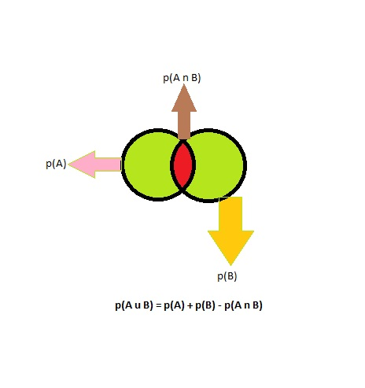

# MIT 6.00SC | Recitation 06 | Probability and Statistics #

## [Probability of Binary Variable ](https://www.youtube.com/watch?v=yVkt3Px4KHA&list=PLB2BE3D6CA77BB8F7#t=27) ##

A **binary variable** which can have only 2 possible outcome, like heads or tails, 0 or 1, on or off.

Lets say we have a variable `A` which can take values `Heads` or `Tails`, so the `p(A=H)` i.e., probability of `A` taking the value `H`.

An important thing to note about probability is that it lies between `0` and `1`, i.e. `0 <= p(A=H) <= 1`. This range of `0` to `1` is continuous and not discrete.

The value of `p(A) = [0,1]`, i.e. the probability of A happening is between `0` and `1`.

So what is the probability of `A` not happening, `p(A^) = 1 - p(A)`

### [Probability of 2 Independent Events](https://www.youtube.com/watch?v=yVkt3Px4KHA&list=PLB2BE3D6CA77BB8F7#t=259) ###

We have discussed the probability of a single event occurring and not occurring. Now lets check what is the probability of 2 independent events occurring. Consider the below table.

In this we are throwing 2 coins:-

|  A  |  p(A)  |  B  |  p(B) |   p(A n B)  |
| :-: | :----: | :-: | :---: | :---------: |
|  H  | `1/2`  |  H  | `1/2` | `1/2 * 1/2` |
|  T  | `1/2`  |  T  | `1/2` | `1/2 * 1/2` |
|  H  | `1/2`  |  T  | `1/2` | `1/2 * 1/2` |
|  T  | `1/2 ` |  H  | `1/2` | `1/2 * 1/2` |

So from the above table, what is the probability of `p(A = H and B = T)`. So this statement is represented as `p(A n B)` i.e A intersection B.

therefore `p(A n B) = p(A) * p(B)`, because both `A` and `B` are independent events.

So the next thing we should try is `p(A = H or B = T)` which is represented by `p(A u B)` i.e A union B.

So this is actually equal to 

````
p(A = H and B = H) * 
p(A = H and B = T) * 
p(A = T and B = H)
````

We can represent this in a Venn Diagram.




## [Multiple Event](https://www.youtube.com/watch?v=yVkt3Px4KHA&list=PLB2BE3D6CA77BB8F7#t=609) ##

We can show multiple event by these representation.

### Trees ###

We represent a [Tree](http://en.wikipedia.org/wiki/Tree_diagram_%28probability_theory%29) in this way:-


Similarly we can represent a dice throw in this way:-


But as you can see, as no of throws increase, the no of branches also grows. So a easier way to represent it is Grid.

### Grid ###

A grid for Dice will look like this:-


**What will be the probability of getting same number in both the dice.**

As seen in the figure above the no of such instance were we get same number on both dice is `6`, of the total possible outcome is `36`, therefore the probability is `6/36`.

**What will be the probability of getting the sum 6, in two dice roll?**

As seen in the figure above the no of such instance were we get sum as `6` is `5`, of the total possible outcome is `36`, therefore the probability is `5/36`.

So we can represent a probability using these 3 methods:-

1. Venn Diagram
2. Trees
3. Grid

## [Concrete Example of Probability ](https://www.youtube.com/watch?v=yVkt3Px4KHA&list=PLB2BE3D6CA77BB8F7#t=846) ##

### 3 Coin Flip ###

Suppose we are flipping 3 coins, So when we flip 3 coins what is the probability of any one out come. It is `2^3 = 8`, because we have `3` coins and each coin can have `2` values, so totally `3` coins can have `8` values. So the probability of any one outcome will be `1/8`.

So based on the above understanding, **What is the probability of getting 2 heads?**

We can solve this using enumeration. The favorable outcomes are:-

````
HHT
HTH
HHT
````

So 3 events are favorable, so the probability of any one of these 3 happening is `3/8`.

### 2 dice with 4 sides. ###

The total no of outcome will be `4^2`, because we have 1 dice which can take 4 values so when we have 2 such dice the total possible outcomes becomes `4^2 = 16`.

So consider the above dice, **What is probability of rolling a `2` and a `3`, not in the given order?**

The favorable outcomes are:-

````
32
23
````

The probability of each happening is `1/16` and `1/16`. So the probability of any of the event occurring is `2/16`.


**What is the probability that the sum of 1 roll is odd?**

The Probability will be `1/2`, because we can either get even or odd.

**What is the probability that both dice have the same value?**

If we have 4 sided dice, the total number of favorable outcome will be `4` and the total possible outcome is `16`. so the probability will be `4/16`.

For an n sided dice, it will be `1/n`.

### A Pack of Card. ###

**What is the probability of getting an Ace?**

There are totally `4` aces in the pack of cards, and totally there are `52` possible outcomes, so totally we have `4/52 = 1/13`

The probability of not getting a Ace = `1 - 1/13`

**What is the probability of getting a specific cards?**
It is `1/52`


### 2 Deck of Cards ###

Sample size = `52 ^ 2`

**What is the probability of getting at least 1 ace?**

`1/13 + 1/3 - (1/13 * 1/13)`


Now till now we have dealt with issues where we knew about some of the probability. What happens if we did not know the probability?

In that case we will run a simulation.

## [Monte Carlo Simulation](https://www.youtube.com/watch?v=yVkt3Px4KHA&list=PLB2BE3D6CA77BB8F7#t=1853) ##

Provided we do not have the probability know in advance, so we can run a simulation, where we can check if how many number of heads we got when we do `n` trails.

So the probability will be `no of times we got heads/ total number of trails.`


### Value of Pie ###

We can find the value of pie by doing this:-

<iframe width="560" height="315" src="https://www.youtube.com/embed/53bKJhCvDqY" frameborder="0" allowfullscreen></iframe>

We can also see the details of this process like [this](http://mathfaculty.fullerton.edu/mathews/n2003/montecarlopimod.html)