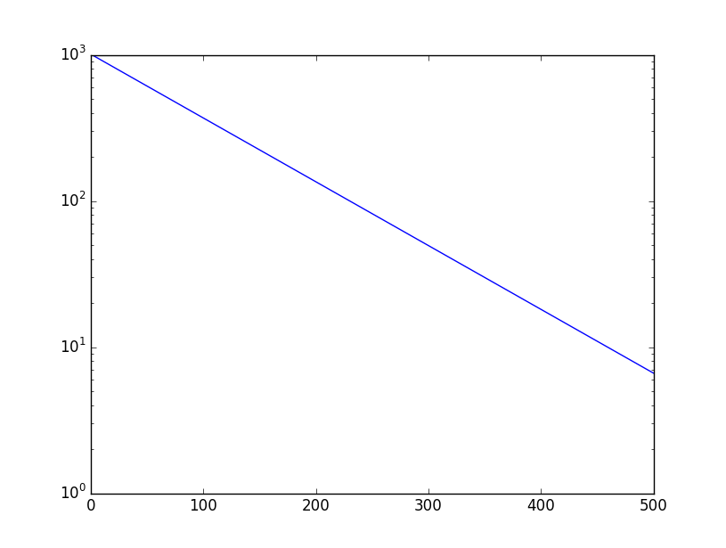
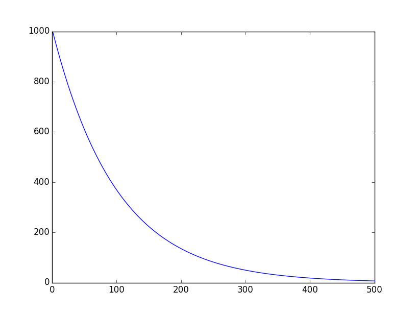
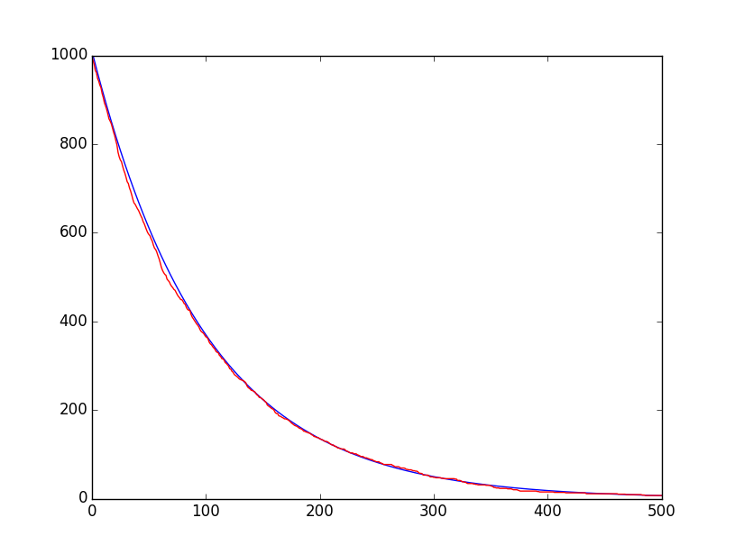
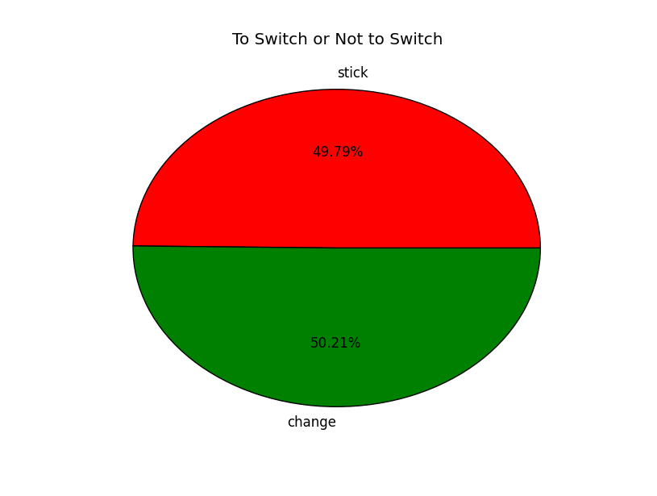
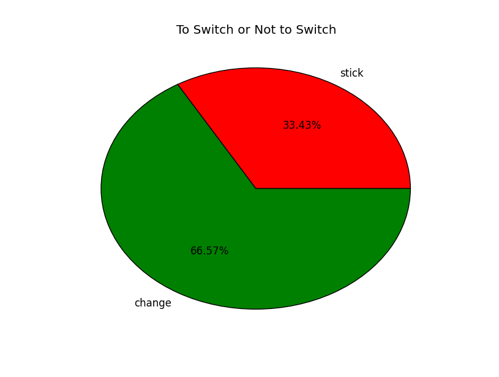

# MIT 6.00SC | Lecture 16 | Using Randomness to Solve Non-random Problems  #

## Computational Models ##

We have seen some models of real world in past lecture, Gaussian or Normal Distribution is a great way to represent real world models with the help of Mean and Standard deviation.

A Normal Distribution can be fully characterized by its **mean** and **standard deviation.** This concept of characterization of a curve based on some parameters help in fully modeling real world system.

Most of time we would like to make a computational models based on normal distribution, because of how nicely it can be characterized and how it informs how closely it lies to the mean.

We have to take care if some thing is not normally distributed and we try to model it that way, we can get misleading results. Not all distribution are normal.

Ex:-

Consider rolling a single dice, each of the six outcome is equally probable, which means we cannot represent it as a normal distribution.

Similarly any fair lottery where the probability of each number coming is equally probable.

So for both of the above case we will have a flat line representing the distribution.

These distribution are called **Uniform Distribution**.

## [Uniform Distribution](https://www.youtube.com/watch?v=Q148jV9ljPM&list=PLB2BE3D6CA77BB8F7#t=164) ##

In a uniform distribution, each result is equally probable. It can be fully characterized by a single parameter its **range**.

Uniform distribution mostly occur in games devised by humans but never in nature, and it is not useful to model complex systems.

## [Exponential Distribution ](https://www.youtube.com/watch?v=Q148jV9ljPM&list=PLB2BE3D6CA77BB8F7#t=243) ##

Other distribution which occur very frequently in nature is **Exponential Distribution**.

The key thing about them is that these are memory less and there are the only continuous distribution which are memory less.

Consider the example, where we check the concentration of a drug in human body.

Assume at time `t` a molecule has a probability `p` of been cleared of drug in human body. The system is memory less which means the probability of a molecule been cleared at any step is irrelevant to what happened before that step.

So at time `t = 1` what is the probability of a molecule been still there in the body is: `1 - p`.

What is the probability of the molecule still there at time `t = 2`: `(1-p)^2` because these are independent events.

Generally, the molecule is still there at time `t = t` is `(1-p)^t`

Consider a problem where at time `t=0` there are `n` molecule so how many molecule will be present at time `t = t`?

See the below code to look into this:-

```python
import pylab

def clear(n,clearProb,steps):
    numRemaning = [n]
    for t in range(steps):
        numRemaning.append(n * ((1 - clearProb) ** t))
    pylab.plot(numRemaning, label = 'Exponential Decay')

clear(1000,0.01,500)    
pylab.semilogy()
pylab.show()
```

The above code will give us a figure like this:-



So we get a straight line in the graph, the reason being we are using a `semilogy` as the Y axis.

If we remove the `semilogy` we will get a curve as shown below.



So if we see the graph, it looks like a exponential decay, which drop sharply and then asymptotes towards 0 but it never quite gets there in a continuous model, In a discrete model we might reach 0 because the last molecule will get cleared or not.

So if we plot a exponential curve on a log axis we will get a straight line.

In the above code, we are using simulation when we are aware of the mathematical equation. We can also use Monte Carlo Simulation to mimic the physical process on which the code is based on.

````python
def clearSim(n,clearProb,steps):
    numRemaning = [n]
    for t in range(steps):
        numLeft = numRemaning[-1]
        for m in range(numRemaning[-1]):
            if random.random() <= clearProb:
                numLeft -= 1
        numRemaning.append(numLeft)
    pylab.plot(numRemaning,"r",label = "simulation")

````

Now we can check the graph of this:-



Now if you check the graph above, the red Curve which is for Monte Carlo Simulation Closely mimics the mathematical representation in blue.

The only difference being the blue curve is much more smother than the Red Curve.

So we have two models:-

1. Analytic Model (blue curve)
2. Simulation Model (red Curve)

Which of these two is better?

Both the models shows the exponential decay, but they are not quite identical, which one should be preferred?

So the way we can answer this question is, when we are simulating a real world problem we should ask the question :-

* Fidelity or credibility
    - When we are simulating a real world problem, a lot of times we are not aware of the real output, so the model have to be credible enough that it mimics the real world problem, else there is no use of the Simulation.
* Utility - What question are answerable with the model. 
    - Now when we make a model, we should also see, what are the question which can be answered by the model, which we were not able to get from real world.
In the example taken before, we do not see much difference w.r.t to the above point of fidelity because the simulation very nicely mimics the mathematical model, but when we consider utility it becomes a completely different ball game.

Consider a scenario where we can ask **what-if** questions, which is very difficult to answer in an analytic model, for example Say the molecule had a property that every `100` time step the molecule can clone themselves. So how will we mimic it.

It will be very difficult to create a analytic model, because we are not aware of the equation which will help in doing this, but a simulation model might help.

The code to do this is here:-

````python
def clearSimWhatif(n,clearProb,steps):
    numRemaning = [n]
    for t in range(steps):
        numLeft = numRemaning[-1]
        for m in range(numRemaning[-1]):
            if random.random() <= clearProb:
                numLeft -= 1
        if t != 0 and t%100 == 0:
            numLeft += numLeft
        numRemaning.append(numLeft)
    pylab.plot(numRemaning,"y",label = "simulation")
````

And the graph will be something like this.


The color of the graphs are like this:-

* yellow : New Simulation for the What if.
* Blue : The analytic model
* Red : The original simulation.

A lot of physical system mimics exponential decay, when we consider half life of nuclear material is a exponential decay, and the algae growth is a exponential growth example.

So we will now discuss a very nice problem based on probability which is **Monty Hall** Problem

## [Monty Hall](https://www.youtube.com/watch?v=Q148jV9ljPM&list=PLB2BE3D6CA77BB8F7#t=1321) ##

We can understand the Monty Hall problem from these two links:-

* [Wikipedia | Monty Hall Problem ](http://en.wikipedia.org/wiki/Monty_Hall_problem)
* [YouTube Video | NumberPhile](https://www.youtube.com/watch?v=4Lb-6rxZxx0)
* [Play The Game ](http://www.math.ucsd.edu/~crypto/Monty/monty.html)

As per Wikipedia a Monty Hall Problem is defines as:-

> Suppose you're on a game show, and you're given the choice of three doors: Behind one door is a car; behind the others, goats. You pick a door, say No. 1, and the host, who knows what's behind the doors, opens another door, say No. 3, which has a goat. He then says to you, "Do you want to pick door No. 2?" Is it to your advantage to switch your choice?

So the whole of Month Hall problem depends on weather to switch or not?

We can analyze the probability of the Monty Hall problem.

When the person choses one door, the probability of winning is `1/3`, and the probability of the prize being on the other 2 doors is `2/3`.

Now next step is important, Monty Hall known which door has the prize, and he most of the times picks a Door to open which does not have the price. So the choice of door is not independent of the choice of the player.

Once that door is opened, if the contestant stay with his original choice the probability is still `1/3` but if he switches the probability increases to `2/3`. So if a contestant get multiple chances, there is a probability that 2 out of 3 times he will win if he switches. But alas each contestant gets only 1 chance, so this probability increase is still counter intuitive.

**Switching doubles the odds of wining.**

So lets run a simulation to understand complex situation like the Monty Hall problem.

````python
import pylab,random

def montyChose(guessDoor,prizeDoor):
    if 1 != guessDoor and 1 != prizeDoor:
        return 1
    if 2 != guessDoor and 2 != prizeDoor:
        return 2
    return 3

def randomChose(guessDoor,prizeDoor):
    if guessDoor == 1:    
        return random.choice([2,3])
    if guessDoor == 2:
        return random.choice([1,3])
    return random.choice([1,2])

def simMontyHall(numTrials=100,chooseFcn = montyChose):
    stickWins = 0
    switchWins = 0
    noWin = 0
    prizeDoorChoices = [1,2,3]    
    guessChoices = [1,2,3]
    for t in range(numTrials):
        prizeDoor = random.choice(prizeDoorChoices)
        guess = random.choice(guessChoices)
        toOpen = chooseFcn(guess, prizeDoor)
        if toOpen == prizeDoor:
            noWin += 1
        elif guess == prizeDoor:
            stickWins += 1
        else:
            switchWins += 1
    return (stickWins,switchWins)

def displayMHSim(simResults):
    stickWins, switchWins = simResults
    pylab.pie([stickWins, switchWins], colors = ['r', 'g'],
              labels = ['stick', 'change'], autopct = '%.2f%%')
    pylab.title('To Switch or Not to Switch')    

simResults = simMontyHall(100000, montyChose)
displayMHSim(simResults)
pylab.figure()
simResults = simMontyHall(100000, randomChose)
displayMHSim(simResults)
pylab.show()
````

Consider the output graph:-
* When Switch is Random

* When Monty Choose


Based on the above 2 graphs we should always switch.

From the lectures till now on Randomness and Monte Carlo Simulation we might get an idea that we can use Monte Carlo Simulation mostly for process which have an inherent randomness.

We can also Randomness to solve problem where randomness play no role. Best example is PI Estimation.

## [Pi Estimation ](https://www.youtube.com/watch?v=Q148jV9ljPM&list=PLB2BE3D6CA77BB8F7#t=2059) ##

Here are some article to learn more of this:-

* [WikiPedi | Estimation of Pi](http://en.wikipedia.org/wiki/Approximations_of_%CF%80)
* [YouTube Video ](https://www.youtube.com/watch?v=VJTFfIqO4TU)
* [Monte Carlo Pi ](http://mathfaculty.fullerton.edu/mathews/n2003/montecarlopimod.html)

Monte Carlo Simulation for estimating Pi is based on the formula of dropping Needles:-

````
Needle in the circle/Needle in the Square = Area or circle/Area of Square

Pi = area of the circle = (area of square * no of needle in circle)/No of needle in Square

````

So we will simulate the above equation in Code:-

````python
import random

def stdDev(X):
    mean = sum(X)/float(len(X))
    total = 0.0
    for x in X:
        total += (x - mean) ** 2
    return (total/len(X))**0.5

def throwNeedles(numNeedles):
    inCircle = 0
    for needle in xrange(1,numNeedles+1,1):
        x = random.random()
        y = random.random()
        if (x * x + y * y) **0.5 <= 1.0:
            inCircle += 1
    return 4*(inCircle/float(needle))

def estPi(precision = 0.01, numTrials = 20):
    numNeedles = 1000
    numTrials = 20
    sDev = precision
    while sDev >= (precision/4.0):
        estimates = []
        for t in range(numTrials):
            piGuess = throwNeedles(numNeedles)
            estimates.append(piGuess)
        sDev = stdDev(estimates)
        curEst = sum(estimates)/len(estimates) 
        curEst = sum(estimates)/len(estimates)
        print 'Est. = ' + str(curEst) +\
              ', Std. dev. = ' + str(sDev)\
              + ', Needles = ' + str(numNeedles)
        numNeedles *= 2
    return curEst
estPi()        
````

## [Integration ](https://www.youtube.com/watch?v=Q148jV9ljPM&list=PLB2BE3D6CA77BB8F7#t=2880)  ##

Integration means the area under the curve denoted by the equation. So we can use Monte Carlo Simulation to find the integral of a equation.

Single Integral Code:-

````python
import random

def integrate(a, b, f, numPins):
    pinSum = 0.0
    for pin in range(numPins):
        pinSum += f(random.uniform(a, b))
    average = pinSum/numPins
    return average*(b - a)

def one(x):
    return 1.0

print integrate(0, 8, one, 100000)
````

Monte Carlo Simulation is not a great way to solve single integral, but it is of great help to solve Double Integral.

Double Integral Code:-

````python
import random
def doubleIntegrate(a, b, c, d, f, numPins):
    pinSum = 0.0
    for pin in range(numPins):
        x = random.uniform(a, b)
        y = random.uniform(c, d)
        pinSum += f(x, y)
    average = pinSum/numPins
    return average*(b - a)*(d - c)

def f(x, y):
    return 4 - x**2 - y**2

print doubleIntegrate(0, 1.25, 0, 1.25, f, 100000)
````

## Reference ##
### Links ###

1. [MIT OCW](http://ocw.mit.edu/courses/electrical-engineering-and-computer-science/6-00sc-introduction-to-computer-science-and-programming-spring-2011/unit-2/lecture-16-using-randomness-to-solve-non-random-problems/)
2. [Lecture Code handout (PDF)](http://ocw.mit.edu/courses/electrical-engineering-and-computer-science/6-00sc-introduction-to-computer-science-and-programming-spring-2011/unit-2/lecture-16-using-randomness-to-solve-non-random-problems/MIT6_00SCS11_lec16.pdf)
3. [Lecture code (Py)](http://ocw.mit.edu/courses/electrical-engineering-and-computer-science/6-00sc-introduction-to-computer-science-and-programming-spring-2011/unit-2/lecture-16-using-randomness-to-solve-non-random-problems/lec16.py)

### Problem Sets ###

1. Problem Set 7: Simulating The Spread of Disease and Virus Population (Due)
    1. [Instructions (PDF)](http://ocw.mit.edu/courses/electrical-engineering-and-computer-science/6-00sc-introduction-to-computer-science-and-programming-spring-2011/unit-2/lecture-16-using-randomness-to-solve-non-random-problems/MIT6_00SCS11_ps7.pdf)
    2.  [Code files (ZIP) ](http://ocw.mit.edu/courses/electrical-engineering-and-computer-science/6-00sc-introduction-to-computer-science-and-programming-spring-2011/unit-2/lecture-16-using-randomness-to-solve-non-random-problems/ps7.py)
    3. [Solutions (ZIP)](http://ocw.mit.edu/courses/electrical-engineering-and-computer-science/6-00sc-introduction-to-computer-science-and-programming-spring-2011/unit-2/lecture-16-using-randomness-to-solve-non-random-problems/ps7_sol.zip)
2. Problem Set 8 (Assigned)
    1. [Problem Set 5 Due on Lecture 18](http://ocw.mit.edu/courses/electrical-engineering-and-computer-science/6-00sc-introduction-to-computer-science-and-programming-spring-2011/unit-2/lecture-18-optimization-problems-and-algorithms)


### Further Study ###

1. **Readings**
    1. [Monte Carlo method ](http://en.wikipedia.org/wiki/Monte_Carlo_method)
    2. [Matplotlib ](http://matplotlib.sourceforge.net/)


### Check Yourself ###
### What is a Gaussian distribution? ###
When the distribution is evenly distributed along the mean.
### What is a uniform distribution? ###
### What is important about an exponential distribution? ###


