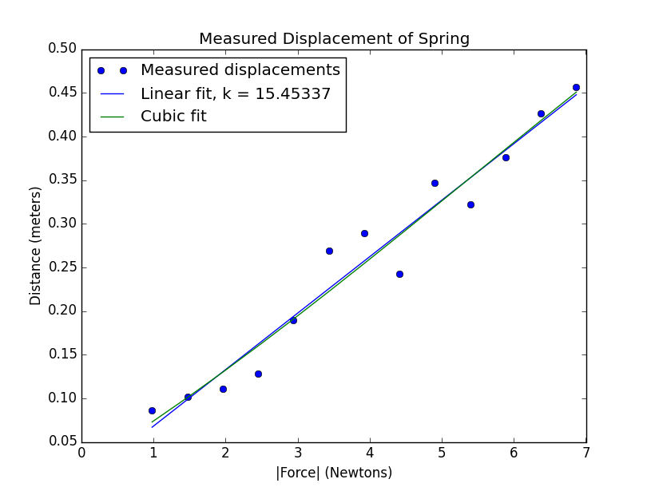

# MIT 6.00SC | Lecture 17 | Curve Fitting #

## [Introduction](https://www.youtube.com/watch?feature=player_detailpage&v=TIQTYgmavC4&list=PLB2BE3D6CA77BB8F7#t=25) ##

In the last lecture, when we were finding the value of Pi, we started with an assumption that if we drop large enough pins and if we repeat this experiment multiple times, if we get a very small standard deviation we will have a correct value of PI.

But this assumption is not correct. This was because we were believing that a statistically sound argument is equivalent to truth.

The use of every statistical test is based on some ground rules:-

* **Independence:** The events are independent to each other or not.
* **Model of reality: ** Simulation are a model of reality.

So in the last lecture when we calculated PI, we based our calculation on [Buffon Laplace Math](http://en.wikipedia.org/wiki/Buffon's_needle), then we did some algebraic calculation and then based on this algebraic calculation derived our code for estimating PI, we got our estimation of PI based on small standard deviation which was as shown below:-

````
import random

def stdDev(X):
    mean = sum(X)/float(len(X))
    total = 0.0
    for x in X:
        total += (x - mean) ** 2
    return (total/len(X))**0.5

def throwNeedles(numNeedles):
    inCircle = 0
    for needle in xrange(1,numNeedles+1,1):
        x = random.random()
        y = random.random()
        if (x * x + y * y) **0.5 <= 1.0:
            inCircle += 1
    return 4*(inCircle/float(needle))

def estPi(precision = 0.01, numTrials = 20):
    numNeedles = 1000
    numTrials = 20
    sDev = precision
    while sDev >= (precision/4.0):
        estimates = []
        for t in range(numTrials):
            piGuess = throwNeedles(numNeedles)
            estimates.append(piGuess)
        sDev = stdDev(estimates)
        curEst = sum(estimates)/len(estimates) 
        curEst = sum(estimates)/len(estimates)
        print 'Est. = ' + str(curEst) +\
              ', Std. dev. = ' + str(sDev)\
              + ', Needles = ' + str(numNeedles)
        numNeedles *= 2
    return curEst
estPi()        
````

But suppose we did a mistake in our code where in place of in the `throwNeedles()` method, we modified this line `return 4*(inCircle/float(needle))` to `return 2*(inCircle/float(needle))`, we will get out estimation of PI as `1.56969296875`, which will be wrong.

So as per the above code, we have nothing wrong with the statistics, but still it is nowhere close to the real value of PI.

The moral of the story is:-

* Before we believe the output of the model, we should have confidence that our conceptual model is correct.
* We have correctly implemented that conceptual model in code.

How can we achieve this:-

* Test our result against reality

To test our result, we can calculate the circumference of circle based on the estimation of PI which we get, so immediately we could have identified that the value of PI is nowhere close to the actual value.

A real scientist when they derives a simulation model, that run some experiments to verify that there model is giving results which is near reality or at least plausible. Statistic identifies that we have got the minute details right but we should also do a sanity check.

## [InterPlay of Physical Reality, Theoretical and Computational ](https://www.youtube.com/watch?list=PLB2BE3D6CA77BB8F7&v=TIQTYgmavC4&feature=player_detailpage#t=277) ##

In real engineering we have to find a cohesive existence of these 3.

* **Physical System : **  A real world problem, which can be stock market or something which exist in real world.
* **Theoretical System : ** Some theory which gives some insight into the Physical system.
* **Computational System : ** When the Theoretical system becomes to complicated we use computation to solve the real world problems.

We can understand these concept we can relive our high school days, when in time for a practical exam for Physics, Chemistry or Biology. In the exam, we have studied the theory and when after doing experiments we get results which are no where close to the theory which we studied, so we know something is wrong, We have three possibility.

* Turn in the same reading which we get and stand a chance of being ridiculed about our sloppiness.
* Turn in the perfect result from the theory and chance of being caught increases.
* Do the smart thing, and make the reading close enough to the theory but have error also there.

The smart solution is the best thing to do, but to model this case, we also have to model for experimental errors.

## [Error Modeling ](https://www.youtube.com/watch?list=PLB2BE3D6CA77BB8F7&v=TIQTYgmavC4&feature=player_detailpage#t=427) ##

We can model the error which are introduced in experiments, this can be done when we know how best to model reality in addition to model error.

The best way to model experimental error, we have to assume there is some sort of perturbation, i.e. deviation from standard flow of the actual data. As per Gauss's analysis, errors are also distributed **normally**.

## [Hook's Law](https://www.youtube.com/watch?list=PLB2BE3D6CA77BB8F7&v=TIQTYgmavC4&feature=player_detailpage#t=470) ##

We can see how to model error, with the help of [Hook's Law](http://en.wikipedia.org/wiki/Hooke%27s_law)

Hook's Law states that

> Hooke's law is a principle of physics that states that the force  needed to extend or compress a spring by some distance  is proportional to that distance


 is a constant factor characteristic of the spring, its stiffness. It is also called Spring Constant.

Hook's law hold for a wide variety of materials, but it does not hold for arbitrary large force. All materials have a elastic limits, and if we stretch beyond this limit, the law fails.

Spring constant tells us how stiff a materials is, like the suspension of an automobile, the spring constant value is very high.

The negative sign in the Hook's law equation means that the Force exerted is in the reverse direction of the displacement.

We can calculate the spring constant using this experiments.


So we know can do some algebra:-

````
F = -Kx ---- (1)
F = ma  ---- (2)    #mass * acceleration 

from (1) and (2)

k = (m * g)/x       # a is changed to g, which is acceleration due to gravity

````

So if we know `m` that is the mass suspended on the spring, and the `x` which is the displacement caused but the mass, we can calculate `k` because `g` is `9.81` mts per sec.

This is a straight forward calculation and we have can get the result fairly easily but the problem is we have experimental error, which is due to environments, so what we do is we put different weight and we calculated different displacement. So we will have series of weight to k points. Since the errors are evenly distributed, so if we do good enough no of experiments we can get a nice estimation of spring constant.

Calculation of spring constant 
* we have the experimental data shared at [Spring Constant ](data/springData.txt). 
* We have a algebraic equation, as show above.
* We will make a computational model based on above data.

Here is the code for computational model:-

````
import pylab

def getData(fileName):
    dataFile = open(fileName,'r')
    distances = []
    masses = []
    discardHeader = dataFile.readline()
    print discardHeader
    for line in dataFile:
        d,m = line.split()
        distances.append(float(d))
        masses.append(float(m))
    dataFile.close()
    return (masses,distances)

def plotData(fileName):
    xVals,yVals = getData(fileName)
    xVals = pylab.array(xVals)
    yVals = pylab.array(yVals)
    xVals = xVals*9.81  #acc. due to gravity
    pylab.plot(xVals, yVals, 'bo', label = 'Measured displacements')
    pylab.title('Measured Displacement of Spring')
    pylab.xlabel('|Force| (Newtons)')
    pylab.ylabel('Distance (meters)')

plotData('../data/springData.txt')
pylab.show()    
````
Lets dissect the code mentioned above:-

* `getData()` : This is the method which reads from a file which is `../data/springData.txt` and returns the masses and distances list.
    - This methods have few interesting steps, `dataFile = open(fileName,'r')` this opens the file in a read only mode.
    - `discardHeader = dataFile.readline()` just removes the header or the first line from the text file.
    - `line.split()` splits each line with space as the separator, which gives us `d` distance and `m` mass for each iteration of experiments, which is stored in a list `distances` & `masses` that is returned as a tuple.
    - We close the file, `dataFile.close()`
* `plotData()`: uses the information from the files and plot some interesting statistics as shown below:-
    - The tuple of `distances` & `masses` is saved into `xVals` and `yVals`
    - Then this `xVals` and `yVals` is converted to a `pylab.array()` which helps us to do a lot of manipulation on each element of the array. This `pylab.array()` is built on top of `numpy.array.`
        + This array is type of list which a sequence of things.
        + This does not have apis like `append` but have some other valuable methods.
        + We can do point wise operation on an array. which we are doing when we do `xVals = xVals*9.81`
        + When multiply one array with another, we get a cross product.
        + In python, we start with a list to build up the list, because we have `append()` methods etc, and once we have the list we convert them to an `array()` so we can do maths on them.
        + These array are very different that the one's in `C` or `java`
    - Once it is converted, we do `xVals = xVals*9.81` which will multiply each item in `xVals` with `9.81` because we changed it to a `pylab.array()`
    - Then we make a plot of `xVals` and `yVals`

The plot will look like this:-


So the big question here is **how to calculate the spring constant?**

To find the spring constant, we have to plot a line based on the above points which we get and the slope of that line will be `k`

Now you might be thinking what the hell just happened we have a simple formula why not use it, or what is this slope and how it is related.

To explain the above phenomenon, let do a little bit of maths.

We know that from the equation of Hook's law.

````
F = -kx
````

We have plotted the graph for `F` and `x`. 

Now if we see the Plot shown above and remember the Equation of straight line will be:-

````
y = mx + b

b = Y intercept, if b = 0

y = mx
````

Since from the plot we have seen that there is no Y intercept so based on the equation `y = mx` we can derive that `m =  k` , so if we can find the slope of the line we will get `k`

Now we have to get that line. Now to get the line passing through two points is easy, we can simply use this formula:-

````
Y - Y1 = m(X - X1)

where 
m = Y2 - Y1/ X2 - X1
````

## [FIT](https://www.youtube.com/watch?list=PLB2BE3D6CA77BB8F7&v=TIQTYgmavC4&feature=player_detailpage#t=1247) ##

We have a Fit line connecting 2 point, using the equation given above. 

When we have a bunch of points scattered around, we have to find a line which is closest enough to fit these points. So find the proper fit for a line through multiple points we need a measure which will tell us the goodness of the fit. We have to chose a **Best Fit.** To find the Best Fit we have to take help of **Objective Function,** which tells the goodness of the fit.

One of the Objective function will be to draw a line which touches most or all points, the problem with that is it is very hard to find such a line.

There is a standard measure to find the best fit which is called **[Least Square Fit.](http://en.wikipedia.org/wiki/Least_squares)**

### [Least Square Fit](https://www.youtube.com/watch?list=PLB2BE3D6CA77BB8F7&v=TIQTYgmavC4&feature=player_detailpage#t=1368) ###

This is the best objective function to identify how well a curve fits a set of points.

The problem statement from [wikipedia](http://en.wikipedia.org/wiki/Least_squares) is:-

> The objective consists of adjusting the parameters of a model function to best fit a data set. A simple data set consists of n points (data pairs)  i = 1, ..., n, where  is an independent variable and   is a dependent variable whose value is found by observation. The model function has the form  where the m adjustable parameters are held in the vector . The goal is to find the parameter values for the model which "best" fits the data. The least squares method finds its optimum when the sum, S, of squared residuals


> is a minimum. A residual is defined as the difference between the actual value of the dependent variable and the value predicted by the model.


So using the above Least square fit, we will get a graphs something like this:-


So in our situation we can explain that, the Line is generated based on the Independent variable i.e the Mass, and the predicted value of the dependent variable i.e. the displacement. Now the Points around the Lines scattered around are the observed values of Mass and Displacement. We calculated the difference between the predicted and the observed value, square it, So by squaring we have discarded the fact if the points are above or below the line, we are just interested in the displacement, then we sum this difference, and if we get a small enough value we can safely say that our fit is correct.

We have a way to validate the fit, but how to really make the fit. We can calculate the best fit using Newton methods, or we can use a simple analytic model which will give us the answer. Th good news is that Pylab has a inbuilt method which helps in doing this `polyfit`.

* `polyfit()`: takes 3 arguments:-
    - Observed Value of X
    - Observed Value of Y
    - Degree of polynomial 
* Returns some value, Depending on the degree of polynomial we have to interpret it differently
    - If the degree of polynomial is `1`, it will return `a` and `b`, which we can use in the equation ` y = ax + b`, so `x` is the independent value, in our case it will be mass.

So lets use these concepts to draw the fit line:-

````
import pylab

def getData(fileName):
    dataFile = open(fileName,'r')
    distances = []
    masses = []
    discardHeader = dataFile.readline()
    print discardHeader
    for line in dataFile:
        d,m = line.split()
        distances.append(float(d))
        masses.append(float(m))
    dataFile.close()
    return (masses,distances)

def fitData(fileName):
    xVals, yVals = getData(fileName)
    xVals = pylab.array(xVals)
    yVals = pylab.array(yVals)
    xVals = xVals*9.81
    pylab.plot(xVals, yVals, 'bo', label = 'Measured displacements')
    pylab.title('Measured Displacement of Spring')
    pylab.xlabel('|Force| (Newtons)')
    pylab.ylabel('Distance (meters)')
    a,b = pylab.polyfit(xVals, yVals, 1)
    estYVals = a*pylab.array(xVals) + b
    k = 1/a
    pylab.plot(xVals, estYVals, label = 'Linear fit, k = '
               + str(round(k, 5)))
    pylab.legend(loc = 'best')

fitData('../data/springData.txt')
pylab.show()        
````

The plot of the above code will be:-


The `polyfit()` uses a concept called **Liner Regression**, to compute the values.

It is not because we are using a line to represent the `polyfit`, but because even if we had a equation of parabola, we can say that the dependent variable `Y` is a linear equation of independent variable `X`, because we will sum the values.

Now can we say that the plot which we just got gives a best fit. Now if we see closely we will find that the points are pretty far away from the best fit line, and I am beginning to have my concerns, because if this fit is not correct, it will directly impact the calculation of spring constant.

Now lets check another variation.

We will make a cubic plot:-

````
import pylab

def getData(fileName):
    dataFile = open(fileName,'r')
    distances = []
    masses = []
    discardHeader = dataFile.readline()
    print discardHeader
    for line in dataFile:
        d,m = line.split()
        distances.append(float(d))
        masses.append(float(m))
    dataFile.close()
    return (masses,distances)
def fitData(fileName):
    xVals, yVals = getData(fileName)
    xVals = pylab.array(xVals)
    yVals = pylab.array(yVals)
    xVals = xVals*9.81
    pylab.plot(xVals, yVals, 'bo', label = 'Measured displacements')
    pylab.title('Measured Displacement of Spring')
    pylab.xlabel('|Force| (Newtons)')
    pylab.ylabel('Distance (meters)')
    a,b = pylab.polyfit(xVals, yVals, 1)
    estYVals = a*pylab.array(xVals) + b
    pylab.plot(xVals, estYVals, label = 'Linear fit')
    a,b,c,d = pylab.polyfit(xVals, yVals, 3)
    estYVals = a*(xVals**3) + b*xVals**2 + c*xVals + d
    k = 1/a
    print "k: ", k
    pylab.plot(xVals, estYVals, label = 'Cubic fit')
    pylab.legend(loc = 'best')
fitData('../data/springData.txt')
pylab.show()        
````

The plot of the graph will look like this:-


So looking into the plot, the cubic fit looks like a better fit, but we should always remember we want to make a model so that we can find values for which we cannot run experiments.

So lets use our model to predict some values.

````
import pylab

def getData(fileName):
    dataFile = open(fileName,'r')
    distances = []
    masses = []
    discardHeader = dataFile.readline()
    print discardHeader
    for line in dataFile:
        d,m = line.split()
        distances.append(float(d))
        masses.append(float(m))
    dataFile.close()
    return (masses,distances)

def fitData(fileName):
    xVals, yVals = getData(fileName)
    extX = pylab.array(xVals + [1.5])
    xVals = pylab.array(xVals)
    yVals = pylab.array(yVals)
    xVals = xVals*9.81
    extX = extX*9.81
    pylab.plot(xVals, yVals, 'bo', label = 'Measured displacements')
    pylab.title('Measured Displacement of Spring')
    pylab.xlabel('|Force| (Newtons)')
    pylab.ylabel('Distance (meters)')
    a,b = pylab.polyfit(xVals, yVals, 1)
    extY = a*pylab.array(extX) + b
    pylab.plot(extX, extY, label = 'Linear fit')
    a,b,c,d = pylab.polyfit(xVals, yVals, 3)
    extY = a*(extX**3) + b*extX**2 + c*extX + d
    pylab.plot(extX, extY, label = 'Cubic fit')
    pylab.legend(loc = 'best')

fitData('../data/springData.txt')
pylab.show()        
````

So in the above code, we have add one extra point for calculation which is the weight of `1.5`. 

The plot of the graph will look like this:-


Now from the above plot we can check that, the cubic curve fitted our existing data very well, but it failed to predict correctly the addition weight's displacement. What could be the reason for this?

The curve fits the existing data very nicely but it has a very bad predictive value.

If we just look into the raw data, we will find that at the end it is flattening out, which is not what Hook's law predict because it should be liner as per Hook's Law, the only possible reason can be that, we have crossed the elastic limit of the spring.

Now we can discard the last 6 points which is beyond the elastic limit and check.

````
import pylab

def getData(fileName):
    dataFile = open(fileName,'r')
    distances = []
    masses = []
    discardHeader = dataFile.readline()
    print discardHeader
    for line in dataFile:
        d,m = line.split()
        distances.append(float(d))
        masses.append(float(m))
    dataFile.close()
    return (masses,distances)

def fitData(fileName):
    xVals, yVals = getData(fileName)
    xVals = pylab.array(xVals[:-6])
    yVals = pylab.array(yVals[:-6])
    xVals = xVals*9.81
    pylab.plot(xVals, yVals, 'bo', label = 'Measured displacements')
    pylab.title('Measured Displacement of Spring')
    pylab.xlabel('|Force| (Newtons)')
    pylab.ylabel('Distance (meters)')
    a,b = pylab.polyfit(xVals, yVals, 1)
    estYVals = a*pylab.array(xVals) + b
    k = 1/a
    pylab.plot(xVals, estYVals, label = 'Linear fit, k = '
               + str(round(k, 5)))
    pylab.legend(loc = 'best')

fitData('../data/springData.txt')
pylab.show()        
````

And the plot will look like this:-


Now this looks like a much better fix, and even if we fit a cubic it will be pretty close to the line.



Now we have a problem to identify which line is a best fit, were we correct in deleting the last 6 points, because we can also delete all the point except just two and we will get a perfect line.

Justification of the above is based on the fact that we have deleted the last 6 point based on our theory of Hook's law that we might have exceeded out elastic limit. We do not have Theoretical justification of deleted arbitrary point which does not fit our curve.

This proves out point with which we started, i.e, there is a interplay between the 3 important pillars:-

* **Physical System : **  The experiment which we conducted.
* **Theoretical System : ** The Hooks Law.
* **Computational System : ** The Fit Line which we computed.

So lets use the above concept on a different spring which is the Bow and arrow.

Now when we draw two curve, one is Line and another is a hyperbola, we find that the line is no where close to the data and the theory, but the hyperbola fits the data perfectly and also if we calculate the means squared error, we will find that the hyperbola is a better fit.

So the mean squared error is a very good measure of the comparison of two fits, but is very bad in validating it in absolute terms, because the means squared error does not have a upper bound.

The Mean square error is another way of identifying the co-efficient of determination, which is explained in next lecture.

## Reference ##
### Links ###

1. [MIT OCW](http://ocw.mit.edu/courses/electrical-engineering-and-computer-science/6-00sc-introduction-to-computer-science-and-programming-spring-2011/unit-2/lecture-17-curve-fitting/)
2. [Lecture Code handout (PDF)](http://ocw.mit.edu/courses/electrical-engineering-and-computer-science/6-00sc-introduction-to-computer-science-and-programming-spring-2011/unit-2/lecture-17-curve-fitting/MIT6_00SCS11_lec17.pdf)
3. [Lecture code (Py)](http://ocw.mit.edu/courses/electrical-engineering-and-computer-science/6-00sc-introduction-to-computer-science-and-programming-spring-2011/unit-2/lecture-17-curve-fitting/lec17.py)
4. [Lecture slides (PDF)](http://ocw.mit.edu/courses/electrical-engineering-and-computer-science/6-00sc-introduction-to-computer-science-and-programming-spring-2011/unit-2/lecture-17-curve-fitting/MIT6_00SCS11_lec17_slides.pdf)
5. [Lecture data files (ZIP)](http://ocw.mit.edu/courses/electrical-engineering-and-computer-science/6-00sc-introduction-to-computer-science-and-programming-spring-2011/unit-2/lecture-17-curve-fitting/lec17_data.zip)


### Check Yourself ###
### What is an objective function? ###
### What method of curve fitting is used by polyfit? ###
### What does curve fitting do? ###
### What is the coefficient of determination? ###


