# MIT 6.00SC | Recitation 07 | Distributions, Monte Carlo, and Regressions #

## [Distribution ](https://www.youtube.com/watch?v=FBKxrPEeCSU&list=PLB2BE3D6CA77BB8F7&t=37) ##

We have 3 types of Distribution which we have talked about:-

1. Uniform Distribution
2. Normal Distribution
3. Exponential Distribution

### Uniform Distribution ###

A Uniform Distribution will look like this:-


The probability will be defined as `1/b-a`

We can plot two type of graph for uniform distribution, and there respective plots

1. Continuous Graph
2. Discrete Graph.

#### Continuous Graph ####

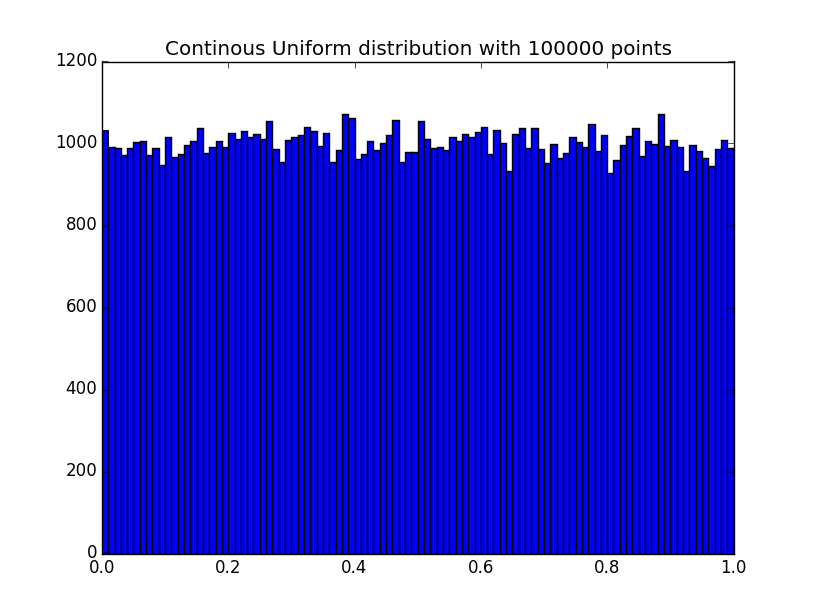

#### Discrete Graph ####

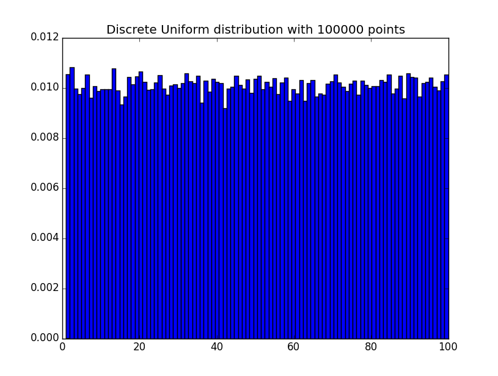

Both the graph looks a quite alike, the only difference being the value of `X` axis and `Y` axis.

### Normal Distribution ###

A Normal Distribution will look like this, we some empirical rules:-


A Normal Distribution have these property:-

* It always peeks at the mean.
* Falls of symmetrically.
* Normal Distribution can be nicely characterized by 2 parameters, **Mean** and **Standard Deviation**.

The function for normal distribution is denoted by:-


> The parameter  in this definition is the mean or expectation of the distribution (and also its median and mode). The parameter  is its standard deviation; its variance is therefore . A random variable with a Gaussian distribution is said to be normally distributed and is called a normal deviate.

### [Exponential Distribution ](https://www.youtube.com/watch?v=FBKxrPEeCSU&list=PLB2BE3D6CA77BB8F7&t=578) ###

In probability theory and statistics, the exponential distribution (a.k.a. negative exponential distribution) is the probability distribution that describes the time between events in a Poisson process, i.e. a process in which events occur continuously and independently at a constant average rate.

The function for Exponential distribution will be:-


## [Monte Carlo](https://www.youtube.com/watch?v=FBKxrPEeCSU&list=PLB2BE3D6CA77BB8F7&t=687) ##

Monte Carlo methods (or Monte Carlo experiments) are a broad class of computational algorithms that rely on repeated random sampling to obtain numerical results.

### Monty Hall Problem ###

One of the good application of Monte Carlo simulation is to solve the Monty Hall Problem, as the code shows below:-

````
import random

def chooseDoor():
    return random.choice([1,2,3])

def playMontyHall(numTrails = 1000):
    stayWins = 0
    switchWins = 0
    for trails in range(numTrails):
        prizeDoor = chooseDoor()    
        playerDoor = chooseDoor()
        if prizeDoor == playerDoor:
            stayWins += 1
        elif prizeDoor != playerDoor:
            switchWins += 1
    print "Stay Wins: ", stayWins/float(numTrails)
    print "Switch Wins: ", switchWins/float(numTrails)

playMontyHall()    
````

### Estimation of PI. ###

We can estimate PI using the below code:-

````
import math
import random
import pylab

#####
# 
# Computing Pi
# 
# Square with 2r length Sides
# Inscribe circle with radius r
# Area of square = (2r)*2 = 4r^2
# Area of circle = pi*r^2
# Ratio of circle area to sqare area is (pi*r^2)/(4r^2) = pi/4
#
# Implication: Of N random points picked from inside square, N*pi/4
# will be inside circle
#
# So if M = number of points inside circle
# M = N*pi/4
# pi = M/N * 4


def randomPoints(r):
    x = random.uniform(-r,r)
    y = random.uniform(-r,r)
    return (x,y)

def makePoints(r,n):
    """
    Make n random points inside square with 2*r side.
    """    
    points = []
    for i in range(n):
        points.append(randomPoints(r))
    return points

def inCircle(r,points):
    x = points[0]    
    y = points[1]

    return x ** 2 + y ** 2 <= r ** 2

def numInCircle(r,points):
    """
    Figure out no of points inside circle of radius r
    """    
    count = 0
    for point in points:
        if inCircle(r,point):
            count += 1
    return count

def computePi(numPoints,points = None):
    """
        Computes Pi using Monte Carlo simulation of n points 
    """ 
    if points is None:
        points = makePoints(1.0,numPoints)
    inCircle = numInCircle(1.0, points)
    return float(inCircle)/float(numPoints) * 4.0

def runTrails(numTrailsPerPoints,numPointsList):
    results = []    
    for numPoints in numPointsList:
        print numPoints
        for trails in range(numTrailsPerPoints):
            results.append((numPoints,computePi(numPoints)))
    return results

def plotPi(trails,trailsResults):    
    numPoints = []
    results = []
    for result in trailsResults:
        numPoints.append(result[0])
        results.append(result[1])
    pylab.figure()
    pylab.clf()
    pylab.scatter(numPoints, results, c="r")
    pylab.plot(trails,[math.pi for trails in trails], c="b")
    pylab.xlabel("Number of Points")
    pylab.ylabel("Pi")
    pylab.title("Pi Vs Number of Points")
    pylab.show()

numTrailsPerPoints = 50
numPointsList = range(10,10000,1000)    
trailsResults = runTrails(numTrailsPerPoints, numPointsList)
plotPi(numPointsList, trailsResults)
````

The plot will look like this:-

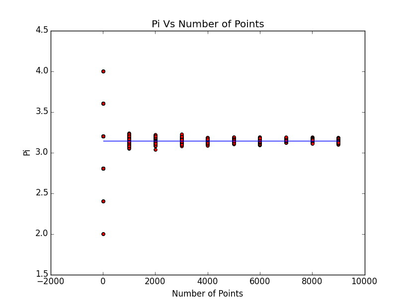

* The blue line on the plot is the exact mathematical calculation of Pi which a computer can do.
* The Red Dots are the estimation of PI, so if we increase the no of trails we see the deviation is much smaller.

We can also check where the needles are dropped.

Here is the code:-

````
def PlotPiScatter(r,n):
    points = makePoints(1.0, n)
    piEstimate = computePi(n,points)

    squarePoints_X = []
    squarePoints_Y = []

    circlePoints_X = []
    circlePoints_Y = []

    for point in points:
        if inCircle(r,point):
            circlePoints_X.append(point[0])
            circlePoints_Y.append(point[1])
        else:
            squarePoints_X.append(point[0])
            squarePoints_Y.append(point[1])
    pylab.figure()
    pylab.clf()
    pylab.scatter(squarePoints_X, squarePoints_Y,c="r")
    pylab.scatter(circlePoints_X, circlePoints_Y,c="b")
    pylab.title("With " +str(n) +" points ")
    pylab.axis([-1.5,1.5,-1.5,1.5])
    pylab.text(-1.4, -1.4, "Pi is estimated to be " +str(piEstimate))
    pylab.show()
````

* No of needles with just 10 points
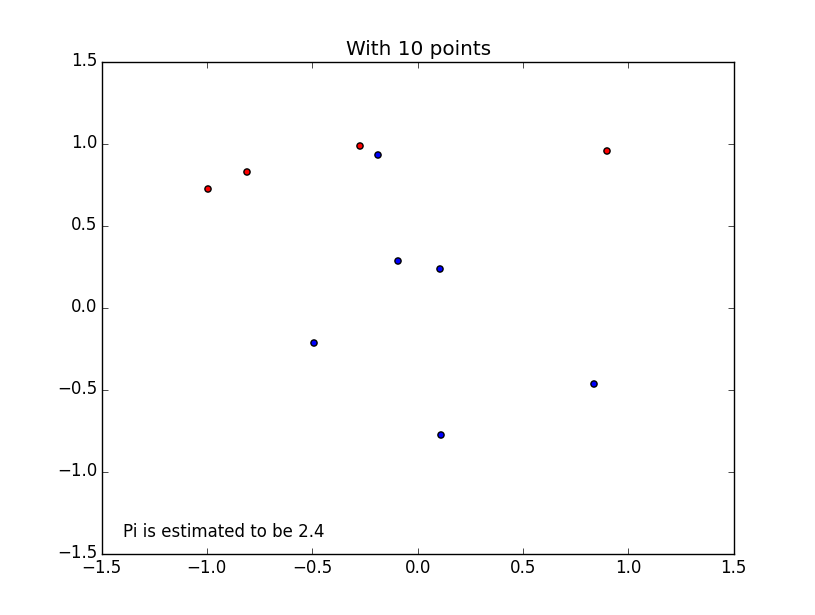
* No of needles with just 100 points
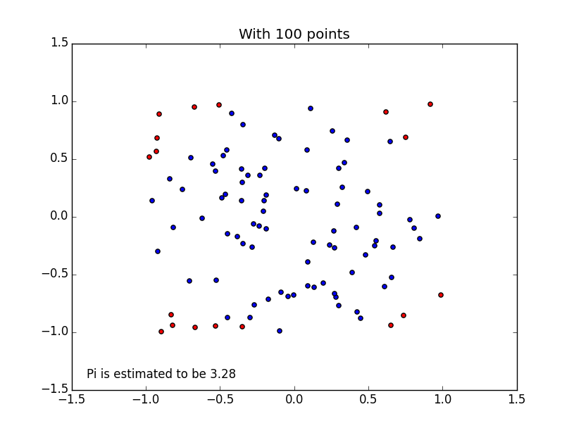
* No of needles with just 1000 points
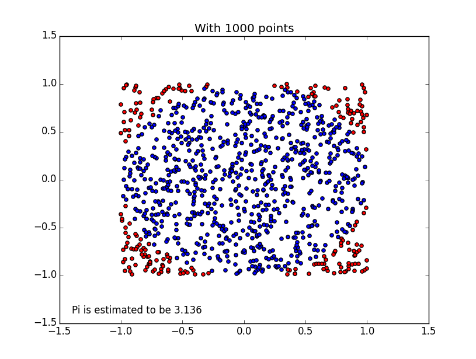
* No of needles with just 10000 points
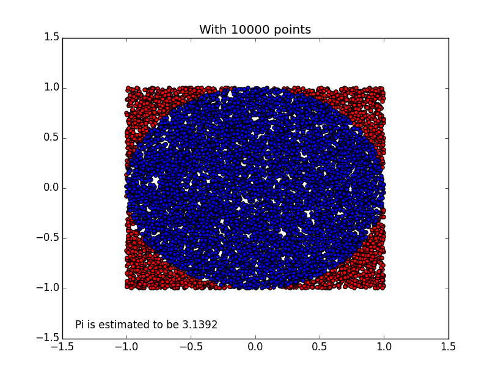
* No of needles with just 1000000 points
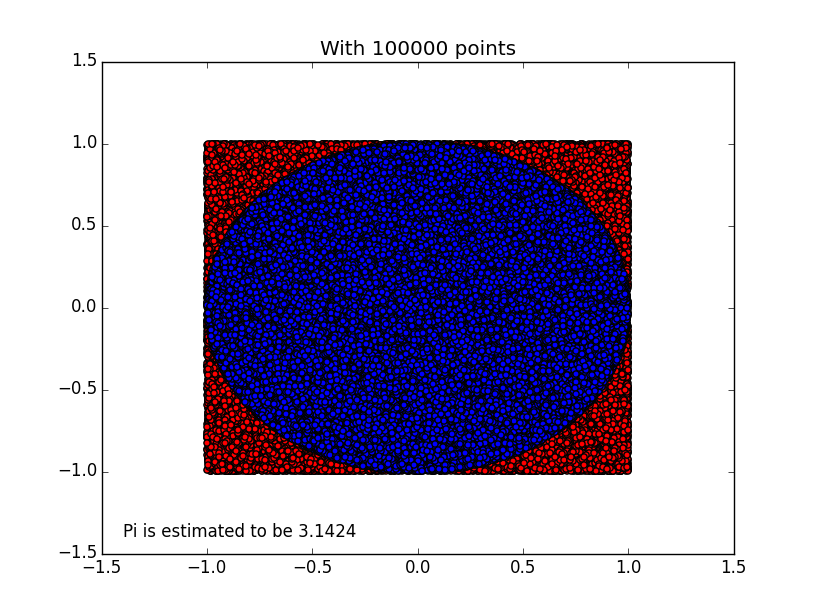

### Numeric Integration ###

We can use the same method of needle drop to find the area of a function using integration.

## [Regressions](https://www.youtube.com/watch?v=FBKxrPEeCSU&list=PLB2BE3D6CA77BB8F7&t=2100) ##

Kindly understand this code:-

````
import math
import random
import numpy
import pylab

# float range
def frange(start,stop,step):
    l = []
    for i in range(int((stop - start)/step)):
        l.append(start + step*i)
    return l

#
# rSquared
#

def mse(measured,predicted):
    """Compute Sum of Residual Square"""
    sum_sq = 0
    for i in xrange(len(measured)):
        sum_sq = (measured[i] - predicted[i]) ** 2
    return float(sum_sq)
def sstot(measured):
    """Compute total of sum square"""
    nMean = sum(measured) /float(len(measured))
    ntot = 0
    for m in measured:
        ntot += (m - nMean) ** 2
    return ntot
def rSquared(measured,predicted):
    """
        measured: list of measured values
        predicted: list of predicted values
    """
    SSerr = mse(measured, predicted)
    SStot = sstot(measured)

    return 1.0 - SSerr/SStot

def makeCurve(f,xs):
    ys = []    
    for x in xs:
        ys.append(f(x))
    return ys

def addNoise(ys, stddev = 1):
    ysp = []
    for y in ys:
        ysp.append(random.gauss(y,stddev))
    return ysp

def makeObservations(xs,f,noise):
    # Make a theoritical curve
    ys = makeCurve(f,xs)    

    # Add some noise to the simulate environment
    nys = addNoise(ys)

    return nys

def showExamplePolyFit(xs,ys,fitDegree1 = 1,fitDegree2 = 2):
    pylab.figure()    
    pylab.plot(xs,ys,'r.',ms=2.0,label = "measured")

    # poly fit to noise
    coeeff = numpy.polyfit(xs, ys, fitDegree1)

    # Predict the curve
    pys = numpy.polyval(numpy.poly1d(coeeff), xs)

    se = mse(ys, pys)
    r2 = rSquared(ys, pys)

    pylab.plot(xs,pys, 'g--', lw=5,label="%d degree fit, SE = %0.10f, R2 = %0.10f" %(fitDegree1,se,r2))

    # Poly fit to noise
    coeeffs = numpy.polyfit(xs, ys, fitDegree2)

    # Predict the curve
    pys = numpy.polyval(numpy.poly1d(coeeffs), xs)

    se = mse(ys, pys)
    r2 = rSquared(ys, pys)

    pylab.plot(xs,pys, 'b--', lw=5,label="%d degree fit, SE = %0.10f, R2 = %0.10f" %(fitDegree2,se,r2))

    pylab.legend()

def f(x):
    return x**3 + 5*x

xs = frange(-2,2,0.001)        
ys = makeObservations(xs, f, 3)

showExamplePolyFit(xs, ys, 1,2)
showExamplePolyFit(xs, ys, 2,3)
showExamplePolyFit(xs, ys, 3,4)
showExamplePolyFit(xs, ys, 4,5)
pylab.show()
````

These are graph which we will get.

* Regression w.r.t 1-degree and 2-Degree
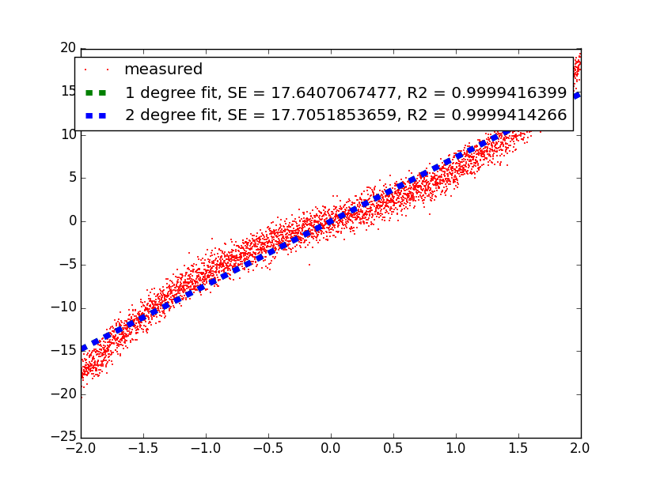
* Regression w.r.t 2-degree and 3-Degree
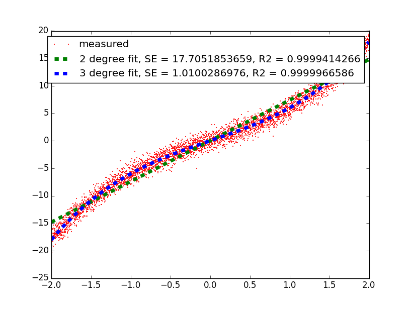
* Regression w.r.t 3-degree and 4-Degree

* Regression w.r.t 4-degree and 5-Degree
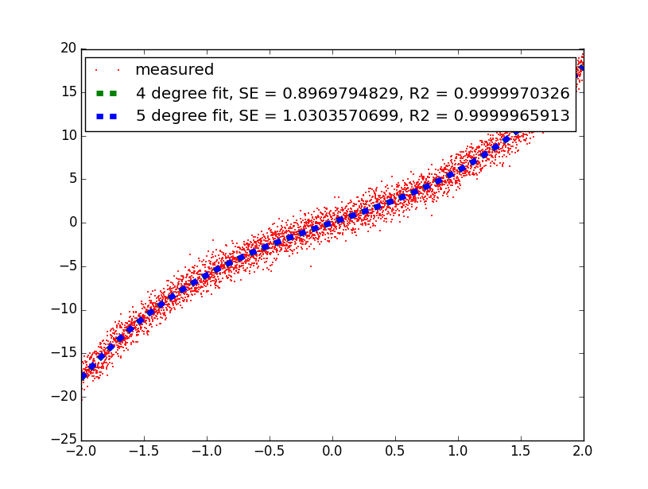

The Standard error are not very good for the range `-2` to `2`, change it to `-5` to `5` and see the difference.