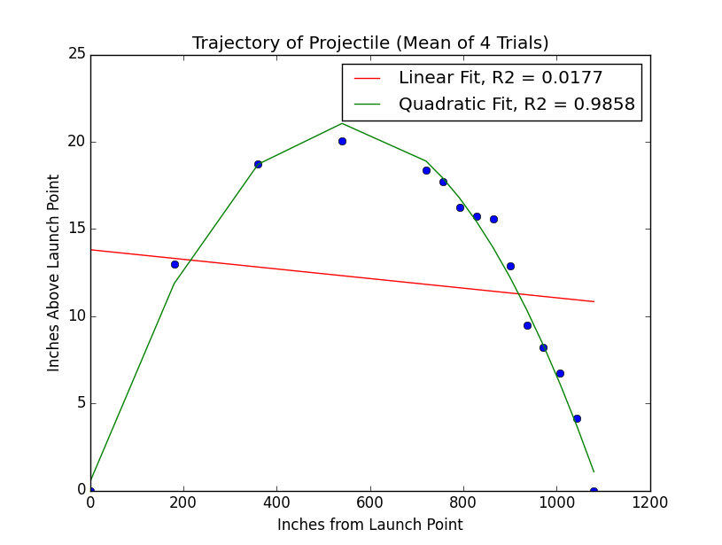
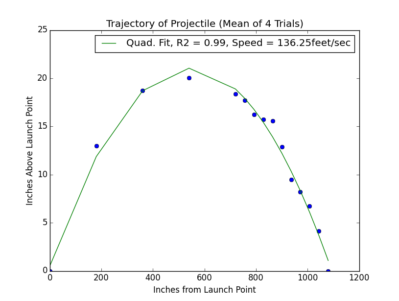

# MIT 6.00SC | Lecture 18 | Optimization Problems and Algorithms #

## [Co-efficient of determination ](https://www.youtube.com/watch?v=BRjwkgQct28&list=PLB2BE3D6CA77BB8F7&t=34) ##

**Co-efficient of determination** is used to find out the goodness of a fit, i.e. How nicely a data fits to a statistical model, usually it is called **RSquared**.

The formula for Co-efficient of determination is represented by:-


Where:-

* 
* 
* A data set has n values marked `y1...yn` (collectively known as `yi`), each associated with a predicted (or modeled) value `f1...fn` (known as `fi`, or sometimes `yi`).

As we can derive from the formula above:-

* **RSquared** always lies between `0` and `1`.
* If **RSquared** equals `1`, that means the model can successfully predict change in possible data.
* If **RSquared** equals `0`, that means the model can never predict all possible data. i.e. The model is not able to predict any data.

Here is the code, to find the **RSquared**:-

````
import pylab

def rSquare(measured,estimated):
    """
        measured: one dimensional array of measured values
        estimated: one dimensional array of predicted values
    """
    EE = ((estimated - measured) ** 2).sum()
    mMean = measured.sum()/float(len(measured))
    MV = ((mMean - measured) ** 2).sum()
    return 1 - EE/MV

def getTrajectoryData(fileName):
    dataFile = open(fileName,'r')    
    distances = []
    heights1,heights2,heights3,heights4=[],[],[],[]
    discardHeader = dataFile.readline()
    print "discardHeader: ", discardHeader
    for line in dataFile:
        d,h1,h2,h3,h4 = line.split()
        distances.append(float(d))
        heights1.append(float(h1))
        heights2.append(float(h2))
        heights3.append(float(h3))
        heights4.append(float(h4))
    dataFile.close()
    return distances,[heights1,heights2,heights3,heights4]

def tryFits(fName):
    distances,heights = getTrajectoryData(fName)
    distances = pylab.array(distances)*36
    totHeights = pylab.array([0]*len(distances))
    for h in heights:
        totHeights = totHeights + pylab.array(h)
    pylab.title('Trajectory of Projectile (Mean of 4 Trials)')
    pylab.xlabel('Inches from Launch Point')
    pylab.ylabel('Inches Above Launch Point')
    meanHeights = totHeights/float(len(heights))
    pylab.plot(distances, meanHeights, 'bo')
    a,b = pylab.polyfit(distances, meanHeights, 1)
    altitudes = a*distances + b
    pylab.plot(distances, altitudes, 'r',
               label = 'Linear Fit' + ', R2 = '
               + str(round(rSquare(meanHeights, altitudes), 4)))
    a,b,c = pylab.polyfit(distances, meanHeights, 2)
    altitudes = a*(distances**2) + b*distances + c
    pylab.plot(distances, altitudes, 'g',
               label = 'Quadratic Fit' + ', R2 = '
               + str(round(rSquare(meanHeights, altitudes), 4)))
    pylab.legend()

tryFits('../data/lec18_launcher.txt')
pylab.show()    
````

The output graph look like this:-



If we analyze the graph closely we find that:-

1. The linear fit represented the line fitting the data, has an rSquared value of `0.0177`, practically meaning, it does not explain any data in the model.
2. Where as in the Quadratic fit, we have an rSuared value of `0.9858`, determining that all the changes in the `y` value is modeled by the model.

Now since we have successfully modeled the data, what is the purpose of making this model.

An important reason for creating a model is to answer question of actual physical situation. So in the above question on important real world question which we should be able to answer is **How fast is the arrow traveling? **

To find the answer to the above question we have to understand the interplay between models, computation and theory.

### [Use of a model](https://www.youtube.com/watch?v=BRjwkgQct28&list=PLB2BE3D6CA77BB8F7&t=345) ###

Lets find the answer to the question, **How fast is the arrow traveling? **

To start with, the curve drawn in the model is that of a parabola, so the general equation of a parabola is:-

**Dimensions of parabolas with axes of symmetry parallel to the y-axis**

These parabola have the general equation as 

The peak of the parabola is exactly at the center of the x-axis, if we call this point as `Xmid`, The `Ypeak` value will be:-

`Ypeak = x * (Xmid)**2 + b * (Xmid) + c`

How do we find the time taken for the arrow to reach from `Ypeak` to `Xmax`. We do not have anything in the data to point in this direction.

So the time to fall from `Ypeak` to height = 0, is purely due to acceleration due to gravity, and it is given by:-

````
t = sqrt(2 * Ypeak / g)
````

Here is the code for finding the speed.

````
import pylab

def getXSpeed(a, b, c, minX, maxX):
    """minX and maxX are distances in inches"""
    xMid = (maxX - minX)/2.0
    yPeak = a*xMid**2 + b*xMid + c
    g = 32.16*12 #accel. of gravity in inches/sec/sec
    t = (2.0*yPeak/g)**0.5
    return xMid/(t*12.0)
    #print 'speed = ' + str(int(xMid/(t*12))) + ' feet/sec'

def getTrajectoryData(fileName):
    dataFile = open(fileName,'r')    
    distances = []
    heights1,heights2,heights3,heights4=[],[],[],[]
    discardHeader = dataFile.readline()
    print "discardHeader: ", discardHeader
    for line in dataFile:
        d,h1,h2,h3,h4 = line.split()
        distances.append(float(d))
        heights1.append(float(h1))
        heights2.append(float(h2))
        heights3.append(float(h3))
        heights4.append(float(h4))
    dataFile.close()
    return distances,[heights1,heights2,heights3,heights4]

def rSquare(measured,estimated):
    """
        measured: one dimensional array of measured values
        estimated: one dimensional array of predicted values
    """
    EE = ((estimated - measured) ** 2).sum()
    mMean = measured.sum()/float(len(measured))
    MV = ((mMean - measured) ** 2).sum()
    return 1 - EE/MV


def processTrajectories(fName):
    distances, heights = getTrajectoryData(fName)
    distances = pylab.array(distances)*36
    totHeights = pylab.array([0]*len(distances))
    for h in heights:
        totHeights = totHeights + pylab.array(h)
    pylab.title('Trajectory of Projectile (Mean of 4 Trials)')
    pylab.xlabel('Inches from Launch Point')
    pylab.ylabel('Inches Above Launch Point')
    meanHeights = totHeights/len(heights)
    pylab.plot(distances, meanHeights, 'bo')
    a,b,c = pylab.polyfit(distances, meanHeights, 2)
    altitudes = a*(distances**2) +  b*distances + c
    speed = getXSpeed(a, b, c, distances[-1], distances[0])
    pylab.plot(distances, altitudes, 'g',
               label = 'Quad. Fit' + ', R2 = '
               + str(round(rSquare(meanHeights, altitudes), 2))
               + ', Speed = ' + str(round(speed, 2)) + 'feet/sec')
    pylab.legend()

processTrajectories('../data/lec18_launcher.txt')
pylab.show()
````

Here is the plot of the graph:-



So from the graph we can say that the speed of the arrow is `136.25 feet/sec`, now here I am substituting accuracy with precession. The `.25` after decimal does not mean that my value is accurate.

The above sequence of event helps us in identifying a pattern, which is mentioned below:-

* Started with an experiments.
* Used computation to both find and evaluate a model.
* Used some theory and analysis and computation to derive a consequence of the model.

## [Optimization ](https://www.youtube.com/watch?v=BRjwkgQct28&list=PLB2BE3D6CA77BB8F7&t=1029) ##

We will not discuss about the optimization in making a program run faster, but will deal with **Optimization Problems**, which is, How do I use programs to find optimal solutions to problem which occur in real life.

Every Optimization problem which we will look into has two parts:-

* An Objective Function. which will either be maximized or minimized.
* A set of constraints, which have to be satisfied.

Once we have found the Objective Function and the set of constraints we can use computation to solve the Optimization problems.

There are certain Optimization problems on which people have worked on for ages.

So when we get a new problem which requires Optimization, we first break it down to a know Optimization problems. This process is called **Problem Reduction.**

The one thing to keep in mind when solving Optimization Problem is, How long/hard they are to solve. Till now the problem which we have solved are pretty fast to solve.

Optimization problem are much worse than sub liner, linear, low order polynomials problems. Most of the time we will see that there is not computationally good way to solve them, most of the time we go for best effort solutions.

## [KnapSack Problem ](https://www.youtube.com/watch?v=BRjwkgQct28&list=PLB2BE3D6CA77BB8F7&t=1349) ##

One of the classical optimization problems are [Knapsack Problem ](http://en.wikipedia.org/wiki/Knapsack_problem). This problem is mentioned as below:-

> The knapsack problem or rucksack problem is a problem in combinatorial optimization: Given a set of items, each with a mass and a value, determine the number of each item to include in a collection so that the total weight is less than or equal to a given limit and the total value is as large as possible. It derives its name from the problem faced by someone who is constrained by a fixed-size knapsack and must fill it with the most valuable items.

So if we see the problem statement above, we can identify that:-

* The Objective function.
    - Maximize the Value of the Knapsack
* Constraints
    - How much weight one can carry.

Consider the below table for the value of example items:-

|          | Value | Weight | Value/Weight |
| :--------| ----: | -----: | -----------: |
| Clock    | 175   | 10     | 17.5         |
| Painting | 90    | 9      | 10           |
| Radio    | 20    | 4      | 5            |
| Vase     | 50    | 2      | 25           |
| Book     | 10    | 1      | 10           |
| Computer | 200   | 20     | 10           |

So from the above table we have to find which items to steal to maximize the value.

The simplest solution is a **Greedy Algorithms.**

### [Greedy Algorithms](https://www.youtube.com/watch?v=BRjwkgQct28&list=PLB2BE3D6CA77BB8F7&t=1503) ###

The solution to above knapsack problem can be found by [Greedy Algorithm ](http://en.wikipedia.org/wiki/Greedy_algorithm), which states that:-

> A greedy algorithm is an algorithm that follows the problem solving heuristic of making the locally optimal choice at each stage[1] with the hope of finding a global optimum

As quoted, a greedy algorithm is a iterative process, in which, at each step we pick the locally optimal solution. The important thing to note is at each step we must know which is a locally optimal solution.

So there are two possibility based on the above table to find a locally optimal solution.

* One approach it to put the most valuable object in the knapsack.
* Other approach is to put the object with least weight in the knapsack.
* Another approach will be to choose the best value to weight ratio.

So irrespective on the approach we take on finding locally optimal solution is guarantee to give a optimal solution.

The present version of the Knapsack problem is called a **0/1 Knapsack Problem**. Which states [that](http://en.wikipedia.org/wiki/Knapsack_problem#0.2F1_knapsack_problem)

> The most common problem being solved is the 0-1 knapsack problem, which restricts the number xi of copies of each kind of item to zero or one

Mathematically the 0-1-knapsack problem can be formulated as:

> Let there be  items,  to  where   has a value  and weight .  is the number of copies of the item , which, mentioned above, must be zero or one. The maximum weight that we can carry in the bag is *W*. It is common to assume that all values and weights are nonnegative. To simplify the representation, we also assume that the items are listed in increasing order of weight.
> * Maximize  subject to 

The other variant is the continuous knapsack problem, for which the greedy algorithm provides a optimal solution.

Most of the Knapsack group of problems are **0/1 Knapsack Problem**

Here is the code to test the **0/1 Knapsack Problem**.

````
class Item(object):
    def __init__(self, n, v, w):
        self.name = n
        self.value = float(v)
        self.weight = float(w)
    def getName(self):
        return self.name
    def getValue(self):
        return self.value
    def getWeight(self):
        return self.weight
    def __str__(self):
        result = '<' + self.name + ', ' + str(self.value) + ', '\
                 + str(self.weight) + '>'
        return result

def buildItems():
    names = ['clock', 'painting', 'radio', 'vase', 'book',
             'computer']
    vals = [175,90,20,50,10,200]
    weights = [10,9,4,2,1,20]
    Items = []
    for i in range(len(vals)):
        Items.append(Item(names[i], vals[i], weights[i]))
    return Items

def greedy(Items, maxWeight, keyFcn):
    assert type(Items) == list and maxWeight >= 0
    ItemsCopy = sorted(Items, key=keyFcn, reverse = True)
    result = []
    totalVal = 0.0
    totalWeight = 0.0
    i = 0
    while totalWeight < maxWeight and i < len(Items):
        if (totalWeight + ItemsCopy[i].getWeight()) <= maxWeight:
            result.append((ItemsCopy[i]))
            totalWeight += ItemsCopy[i].getWeight()
            totalVal += ItemsCopy[i].getValue()
        i += 1
    return (result, totalVal)

def value(item):
    return item.getValue()

def weightInverse(item):
    return 1.0/item.getWeight()

def density(item):
    return item.getValue()/item.getWeight()

def testGreedy(Items, constraint, getKey):
    taken, val = greedy(Items, constraint, getKey)
    print ('Total value of items taken = ' + str(val))
    for item in taken:
        print '  ', item

def testGreedys(maxWeight = 20):
    Items = buildItems()
    print('Items to choose from:')
    for item in Items:
        print '  ', item
    print 'Use greedy by value to fill a knapsack of size', maxWeight
    testGreedy(Items, maxWeight, value)
    print 'Use greedy by weight to fill a knapsack of size', maxWeight
    testGreedy(Items, maxWeight, weightInverse)
    print 'Use greedy by density to fill a knapsack of size', maxWeight
    testGreedy(Items, maxWeight, density)

testGreedys()    
````

The output is:-

````
Items to choose from:
   <clock, 175.0, 10.0>
   <painting, 90.0, 9.0>
   <radio, 20.0, 4.0>
   <vase, 50.0, 2.0>
   <book, 10.0, 1.0>
   <computer, 200.0, 20.0>
Use greedy by value to fill a knapsack of size 20
Total value of items taken = 200.0
   <computer, 200.0, 20.0>
Use greedy by weight to fill a knapsack of size 20
Total value of items taken = 170.0
   <book, 10.0, 1.0>
   <vase, 50.0, 2.0>
   <radio, 20.0, 4.0>
   <painting, 90.0, 9.0>
Use greedy by density to fill a knapsack of size 20
Total value of items taken = 255.0
   <vase, 50.0, 2.0>
   <clock, 175.0, 10.0>
   <book, 10.0, 1.0>
   <radio, 20.0, 4.0>
````

So this shows, that the greedy by density will give the best value, but in this case only, it is not guarantee that every time this will give the best result.

Lets check the algorithmic complexity of the above greedy algorithms.

The reason that greedy algorithms are so popular is because:-

* The Greedy algorithms are easy to program
* They are highly efficient.

To find the algorithmic complexity, we have to look into this function:-

````
def greedy(Items, maxWeight, keyFcn):
    assert type(Items) == list and maxWeight >= 0
    ItemsCopy = sorted(Items, key=keyFcn, reverse = True)
    result = []
    totalVal = 0.0
    totalWeight = 0.0
    i = 0
    while totalWeight < maxWeight and i < len(Items):
        if (totalWeight + ItemsCopy[i].getWeight()) <= maxWeight:
            result.append((ItemsCopy[i]))
            totalWeight += ItemsCopy[i].getWeight()
            totalVal += ItemsCopy[i].getValue()
        i += 1
    return (result, totalVal)
````

So lest check what this function is doing:-

* the first thing it does, is sort the list, so considering merge sort as the sorting algo, we get the complexity as `O(len(Item) * log(len(n)))`
* Then we have the `while` loop, so how many time is the `while` loop executed. `O(len(Items))`

From the above logic, we should say the complexity is `O(len(Item) * log(len(n)))` which is good, this is the best reasoning for using greedy algorithms. It always give a better performance.

Though Greedy algorithms are very good in performance, but we have just one problem with it, which is, a locally optimal solution is not always a globally optimal solution.

**What will happen if we have to choose a absolute optimal solution?**

So first lets formulate the problem:-

* Each item is represented by a pair `<value,weight>`
* W = As the maximum weight which can be carried.
* The set of available item as a vector, I 
* Another vector V, indicating if item from I is taken, V[i] = 1, then I[i] is taken.

* So the Objective function is to maximize the `sum of V[i]* I[i].value`
* Subject to the constraint `sum of V[i]* I[i].weight <= W`

What will be the algorithmic complexity if we implement it in the most simple way?

We can implement in most simplest way by 
* enumerate all possibility.
* Choose the best which meets the constraints.

If we have `n` items, the V will be of `n` size. And the different values it can take is `2^n`. So we will have `2^n` no of combination to choose from, which make it a very difficult to solve, as the total computation to check just 50 item will be around 4 decade.

## Reference ##
### Links ###

1. [MIT OCW](http://ocw.mit.edu/courses/electrical-engineering-and-computer-science/6-00sc-introduction-to-computer-science-and-programming-spring-2011/unit-2/lecture-18-optimization-problems-and-algorithms/)
2. [Lecture Code handout (PDF)](http://ocw.mit.edu/courses/electrical-engineering-and-computer-science/6-00sc-introduction-to-computer-science-and-programming-spring-2011/unit-2/lecture-18-optimization-problems-and-algorithms/MIT6_00SCS11_lec18.pdf)
3. [Lecture code (Py)](http://ocw.mit.edu/courses/electrical-engineering-and-computer-science/6-00sc-introduction-to-computer-science-and-programming-spring-2011/unit-2/lecture-18-optimization-problems-and-algorithms/lec18.py)
4. [Lecture slides (PDF)](http://ocw.mit.edu/courses/electrical-engineering-and-computer-science/6-00sc-introduction-to-computer-science-and-programming-spring-2011/unit-2/lecture-18-optimization-problems-and-algorithms/MIT6_00SCS11_lec18_slides.pdf)
5. [Launcher data file (TXT)](http://ocw.mit.edu/courses/electrical-engineering-and-computer-science/6-00sc-introduction-to-computer-science-and-programming-spring-2011/unit-2/lecture-18-optimization-problems-and-algorithms/lec18_launcher.txt)

### Problem Sets ###

1. Problem Set 8: Simulating The Spread of Disease and Virus Population (Due)
    1. [Instructions (PDF)](http://ocw.mit.edu/courses/electrical-engineering-and-computer-science/6-00sc-introduction-to-computer-science-and-programming-spring-2011/unit-2/lecture-18-optimization-problems-and-algorithms/MIT6_00SCS11_ps8.pdf)
    2.  [Code files (ZIP) ](http://ocw.mit.edu/courses/electrical-engineering-and-computer-science/6-00sc-introduction-to-computer-science-and-programming-spring-2011/unit-2/lecture-18-optimization-problems-and-algorithms/ps8.zip)
    3. [Solutions (ZIP)](http://ocw.mit.edu/courses/electrical-engineering-and-computer-science/6-00sc-introduction-to-computer-science-and-programming-spring-2011/unit-2/lecture-18-optimization-problems-and-algorithms/ps8_sol.zip)
2. Problem Set 9 (Assigned)
    1. [Problem Set 9 Due on Lecture 20](http://ocw.mit.edu/courses/electrical-engineering-and-computer-science/6-00sc-introduction-to-computer-science-and-programming-spring-2011/unit-3/lecture-20-more-clustering)


### Check Yourself ###
### What does an optimization problem consist of? ###
### What is problem reduction? ###
